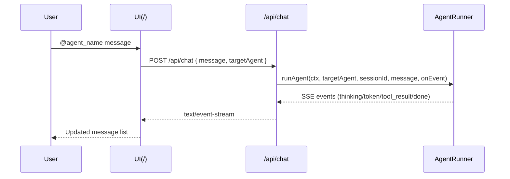
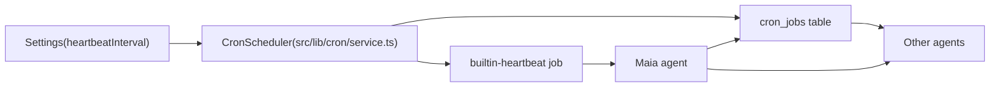

# Agent System Architecture

## Agent behavior (AGENTS.md)

`AGENTS.md` is loaded from the agent's directory (`data/agents/<id>/AGENTS.md`) or project root and injected into the system prompt with explicit attribution (see System prompt order below). It describes how agents should function—context tools, workspace, safety, tools—and can be edited per agent. If the per-agent file is missing or empty, the system falls back to `AGENTS.md` at project root.

## Agent Identity

Each agent has a directory at `data/agents/<agent_id>/`. Identity files at the root are **SOUL.md** and **AGENTS.md** only. Memory and user facts live in **memory/** and **user/** as small files and are retrieved via **knowledge_search** with scope (self, user, global, or another agent id); they are not injected as blocks into the system prompt.

```
data/agents/agent_007/
├── AGENTS.md    # How this agent should function (fallback: project root AGENTS.md)
├── SOUL.md      # Who the agent is (included in system prompt with attribution)
├── workspace/   # Agent file work
├── memory/      # Small fact files (e.g. fact.md); retrieved via knowledge_search
└── user/        # Small fact files about the user; retrieved via knowledge_search
```

### SOUL.md

The agent's self-concept (name, personality, expertise). Included in the system prompt with attribution. Edited via the **terminal** from the agent directory.

### memory/ and user/

Persistent facts the agent deems important (user preferences, decisions, lessons learned) live as small files under `memory/` and `user/`. Agents retrieve them via **knowledge_search** with the appropriate scope. Results include **last_modified**; files older than the archive duration are excluded unless **include_archived: true**. Agents create and edit these files via the **terminal**.

## System prompt order

The system prompt is built in this order (in `buildSystemPrompt` and `transformContext`):

1. **Agent ID** — e.g. "You are agent \`<agent_id>\`".
2. **System date and time** — Current ISO/local datetime and timezone.
3. **AGENTS.md** — A line stating that the following instructions are from `data/agents/<agent_id>/AGENTS.md`, then the full AGENTS content.
4. **SOUL.md** — A line stating that the following is from `data/agents/<agent_id>/SOUL.md`, then the SOUL content.

There are no "Memory" or "User" blocks in the prompt; memory and user facts are in `memory/` and `user/` and are retrieved via **knowledge_search** when the agent needs them.

## Context pipeline

Context is built and passed to the LLM as follows:

1. **transformContext** — Combines (optionally empty) recent-thread and smart-context blocks with the system prompt into a single system string. By default, recent thread and smart context are not included; agents discover tools via **find_tool** and skills via **find_skill** (the only two tools in the minimal set); they use these to get prior context and other capabilities as needed. Implemented in `src/lib/agent/context-query.ts` as `transformContext(recentThreadBlock, smartContextBlock, systemPromptContent)`.

2. **convertToLlm** — Maps that system string plus the user message (and optional initial tool result) to the `Message[]` format the AI provider expects.

Flow: `systemPromptContent` (agent ID → date/time → AGENTS with attribution → SOUL with attribution) → `transformContext` → `convertToLlm` → `Message[]` → LLM.

## Agent Execution Loop

The diagram below refines the ASCII flow into a Mermaid diagram that matches the implementation in `src/lib/agent/runner.ts`.

```mermaid
flowchart TD
  triggerNode["Trigger(user/heartbeat/agent)"] --> loadAgent["LoadAgentDefinition"]
  loadAgent --> validateModel["ValidateModelWhitelisted"]
  validateModel -->|no| errorNode["Skip/BlockAgent"]
  validateModel -->|yes| buildContext["BuildContext(system+identity+tools)"]
  buildContext --> callLlm["CallLLM"]
  callLlm --> parseResp["ParseResponse"]
  parseResp -->|\"text only\"| finalText["FinalTextResponse"]
  parseResp -->|\"tool calls\"| execTools["ExecuteTools"]
  execTools --> appendResults["AppendToolResults"]
  appendResults --> callLlm
  finalText --> compress["CompressionAgent"]
  compress --> storeHistory["StoreHistory(original+compressed)"]
  storeHistory --> emitSse["EmitSSEEvent"]
```

- **Trigger**: a user message (`/api/chat`), a heartbeat, or an agent-to-agent message.
- **Load agent**: `getAgentIdentity(ctx, agentId)` plus settings from `getSettings(ctx)`.
- **Validate model**: checks `settings.whitelistedModels` before running.
- **Build context**: uses `buildSystemPrompt`, `formatRecentThreadTurns`, and `buildSmartContextBlock` to assemble system, recent history, and smart context.
- **Call LLM**: uses a provider from `createProvider` with streaming callbacks for `thinking` and `token` events.
- **Execute tools**: runs tools from `getToolsForAgent(agent.id)` via the tool registry.
- **Store history**: appends user, tool, thinking, and agent entries to `history_entries` and schedules indexing.
- **Emit SSE**: uses `ctx.events.emit` so `/api/events` can stream updates to the UI.

## Agent Communication

### Agent → User

An agent can post to the active user session at any time using `message_send({ to: "user", text: "..." })`. This:

1. Adds the agent to the session's `participants` array if not already present.
2. Appends the message as an `"agent"` role entry.
3. Emits an SSE event causing the UI to update.

### Agent → Agent

An agent uses `message_send({ to: targetAgentId, text: content })`. This:

1. Searches for an existing session where `participants` contains exactly `[senderAgentId, targetAgentId]`.
2. If found, appends to that session.
3. If not found, creates a new session in `data/history/agents/`.
4. The target agent is triggered to respond (either synchronously or at next heartbeat).

### User → Specific Agent

The user prefixes their message with `@agent_name`. The system:

1. Resolves `agent_name` to an `agent_id`.
2. Adds that agent to the active user session.
3. Routes the message to that agent's execution loop.
4. The agent responds within the user session.



## Heartbeat and per-agent cron

Every N minutes (configurable via `heartbeatIntervalMinutes`), a **heartbeat** runs that wakes **only Maia**. She receives:

- A prompt to **check the task board and the cron job list**, assign unassigned tasks, and ensure each active agent has a cron job. She does not message agents—they run on their own cron schedule.
- The current task board (unassigned and in-progress tasks), cron jobs table, and agents list.

Maia does not wake other agents directly via the heartbeat. There are **no automatic per-agent cron jobs** (no staggered agent-run job creation in code). Maia schedules each agent’s cron via **cron_schedule** at her chosen time and frequency (e.g. so agents do not overlap). When an agent’s cron fires, that agent is run with the scheduled tool (typically `cron_echo`) and a reminder to review tasks and take action. The heartbeat thus coordinates via tasks and cron; agents run when their Maia-scheduled jobs fire.



- **Heartbeat job**: Implemented as a built-in cron job that runs an internal heartbeat tool. Wakes Maia, who inspects tasks and cron jobs and creates or adjusts agent cron jobs via **cron_schedule** so every active agent has a run schedule.
- **Per-agent jobs**: Created by Maia via **cron_schedule** (not automatic). When they fire, they run the agent with the scheduled tool (e.g. `cron_echo`) and a reminder to review tasks and memory. Agent creation and lifecycle (instantiate, soul, task, cron) is documented in a Maia-only skill in `defaults/maia/skills/agent-creation-and-lifecycle.md` (seeded to `data/agents/maia/skills/`).

## Maia — The Orchestrator

Maia is the only agent that can:

- Create new agents
- Delete agents
- Schedule cron jobs
- Manage the cron job list

Maia's responsibility is to:

1. Understand the user's high-level goals.
2. Break them into discrete, assignable tasks.
3. Create specialized agents for those tasks (see the agent-creation skill in `defaults/maia/skills/`).
4. Monitor the task board and cron jobs on each heartbeat; ensure each agent has a cron job (via **cron_schedule**) at times that do not overlap.
5. Synthesize agent outputs for the user.

Maia should NOT directly implement features or run commands when she can delegate. Her value is in coordination and synthesis.

## Model Assignment

Each agent has a model assigned at creation:

- `ollama/llama3.2` — local lightweight model
- `ollama/qwen2.5-coder` — local code-specialized model
- `openrouter/anthropic/claude-3.5-haiku` — cloud model

The system validates the model against `settings.whitelistedModels` before:

- Creating an agent
- Triggering an agent (heartbeat or message)

If the model is not whitelisted, the agent is silently skipped (not triggered) and a warning is logged.
