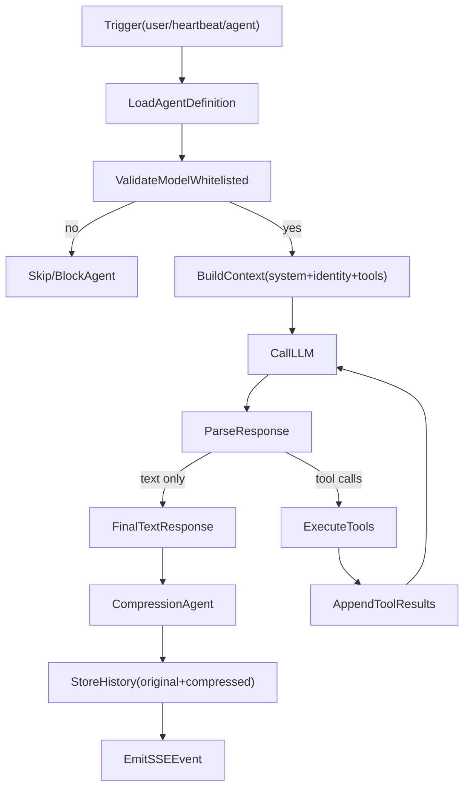
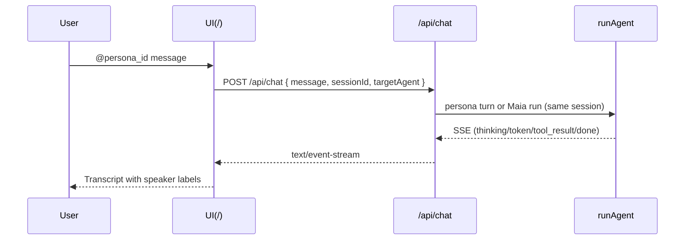

# Agent System Architecture

Maia is the **single long-lived orchestrator** (`agent_id` `maia`). **Delegated personas** are Codex-style `.toml` templates loaded from `defaults/personas/catalog` plus `data/personas/catalog`, with optional layered markdown at `data/personas/overrides/<id>.md`. Maia-only tools register new templates (**`persona_catalog_upsert`**) or replace overrides (**`persona_override_write`**).

Maia’s **orchestrator persona** lives as markdown in **`data/agents/maia/PERSONA.md`** (seeded from `defaults/maia/PERSONA.md`). Edits accumulate over time via **`file_write`** or Maia-initiated updates—there is **no separate SOUL / AGENTS / MEMORY trio** going forward.

**Persona turns** still reuse Maia’s workspace, honor history speaker labels, and run through **`persona_run`** / **`message_send`** / `@persona` mentions inside one **user session** (`["user","maia"]`).

## Orchestrator persona (`PERSONA.md`)

`getAgentIdentity` surfaces `persona` as the trimmed contents of `data/agents/<id>/PERSONA.md`. Stray **`AGENTS.md`**, **`SOUL.md`**, or **`MEMORY.md`** files at the agent root are ignored for persona loading and excluded from semantic indexing.

Optional fallback: project-root **`PERSONA.md`** is used only when agent-level **`PERSONA.md`** is absent or blank (`buildSystemPrompt` in `src/lib/agent/runner.ts`).

## Delegated personas (catalog)

Catalog personas ship under **`defaults/personas/catalog`** and can be extended/overridden under **`data/personas/catalog/<slug>.toml`**. Overrides merge **after** base instructions—exact precedence lives in `src/lib/personas/registry.ts`.

## Agent directory layout

```
data/agents/maia/
├── PERSONA.md   # Orchestrator persona + evolving guidance (indexed separately from rag corpus)
├── workspace/   # Working tree Maia edits via file tools / terminal
├── life/        # PARA tree (projects, areas, resources, archives)
├── memory/      # Markdown facts retrieved via knowledge_search (scoped self)
└── user/        # Markdown facts retrieved via knowledge_search (scoped user)
```

Facts stay under **`memory/`** and **`user/`**; they are excluded from wholesale prompt stuffing and remain accessible via **knowledge_search** plus layered-memory helpers.

## System prompt order (`buildSystemPrompt`)

The orchestrator prompt is assembled as follows (`src/lib/agent/runner.ts`):

1. **`SECURITY_PREAMBLE`** — immutable rules (`src/lib/security/preamble.ts`).
2. **Agent identity line** — `You are agent \`<agent_id>\``.
3. **System date and time** — ISO/local timestamps + timezone.
4. **Persona attribution** — cites `data/agents/<id>/PERSONA.md`, project-root fallback, or compiled fallback messaging.
5. **Persona markdown / fallback instructions** — primary behavioral prose plus optional `system_prompt_extra` from SQLite.
6. **Matched skills block** — optional `## Active skills` appended when skill routing succeeds.

Delegated persona prompts (`buildPersonaSystemPrompt`) prepend **`SECURITY_PREAMBLE`** plus persona-specific scaffolding before template instructions.

## Context pipeline

Context is built and passed to the LLM as follows:

1. **Recent thread** — Last N **prior** user rounds (excluding the message being sent now), formatted with thinking omitted; see [Context window](context-window.md).

2. **Smart context block** — Pre-prompt recall (`buildPrepromptMemoryBlock`: registry, episodes, PARA scan, daily note excerpt) is prepended, then per-turn semantic retrieval (`buildSmartContextBlock`: queries → vector search → filter/summary) and matched skills.

3. **transformContext** — Combines `recentThreadBlock`, `smartContextBlock`, and `systemPromptContent` in `src/lib/agent/context-query.ts`.

4. **convertToLlm** — Maps that system string plus the user message (and optional initial tool result) to the `Message[]` format the AI provider expects.

Flow: `(recent thread + smart context)` → `transformContext(..., systemPromptContent)` → `convertToLlm` → `Message[]` → LLM. Agents still discover most tools via **find_tool** / **find_skill** in the minimal tool set; layered-memory tools are available from the full registry once discovered.

## Agent Execution Loop



- **Trigger**: user chat (`/api/chat`), heartbeat payload, queued `message_send`, or delegated persona entry points.
- **Load agent**: `getAgentIdentity(ctx, agentId)` plus settings from `getSettings(ctx)`.
- **Validate model**: checks `settings.whitelistedModels` before running.
- **Build context**: uses `buildSystemPrompt`, `formatRecentThreadTurns`, and `buildSmartContextBlock`.
- **Call LLM**: uses `createProvider` with streaming callbacks for thinking/token/tool phases.
- **Execute tools**: routes through `getToolsForAgent(agent.id)` registrations.
- **Store history**: persists transcripts + schedules embeddings/index passes.

## Communication (unified transcript)

### Agent → User

Agents append `"agent"` role entries via `message_send({ to: "user", text })`, tagging speaker metadata when present.

### Agent → Maia, persona, or another agent id

`message_send({ to: "maia" | personaId | agentId, text })` never forks another thread—it schedules **`runAgent`** against the caller session (`src/lib/messaging-service.ts`).

### User → persona (chat)

Leading `@persona-id` mentions route through `/api/chat` persona-turn handling without spawning parallel sessions.



## Heartbeat + cron

The heartbeat scheduler wakes **Maia only**. Her injected checklist emphasizes tasks and cron hygiene plus persona delegation reminders (`src/lib/tools/heartbeat-tool.ts`). Cron targets typically remain **`maia`**, though SQLite still stores arbitrary `agent_id` references for scheduled jobs and messaging.

## Maia-only tooling snapshot

Beyond universal tools, Maia receives persona orchestration helpers:

- **`persona_list`**, **`persona_get`**, **`persona_run`**
- **`persona_catalog_upsert`** — writes/replaces `data/personas/catalog/<slug>.toml`
- **`persona_override_write`** — replaces markdown overrides layered atop catalog personas

Cron scheduling, thread helpers, credential tooling, and custom-tool manifests remain Maia-only per `src/lib/tools/registry.ts`.

## Model assignment

- **`agents` table**: Maia keeps her orchestrator model default here.
- **Persona turns**: explicit model overrides must remain whitelisted (`readModelsConfig`).
- Vendor `.toml` model hints remain informational unless mirrored into settings.
