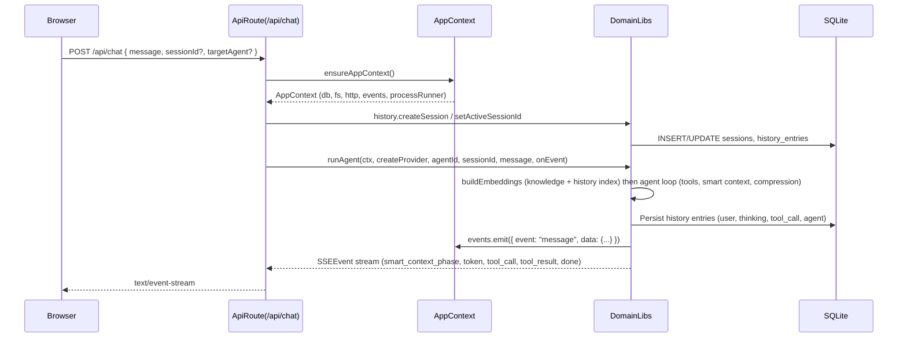
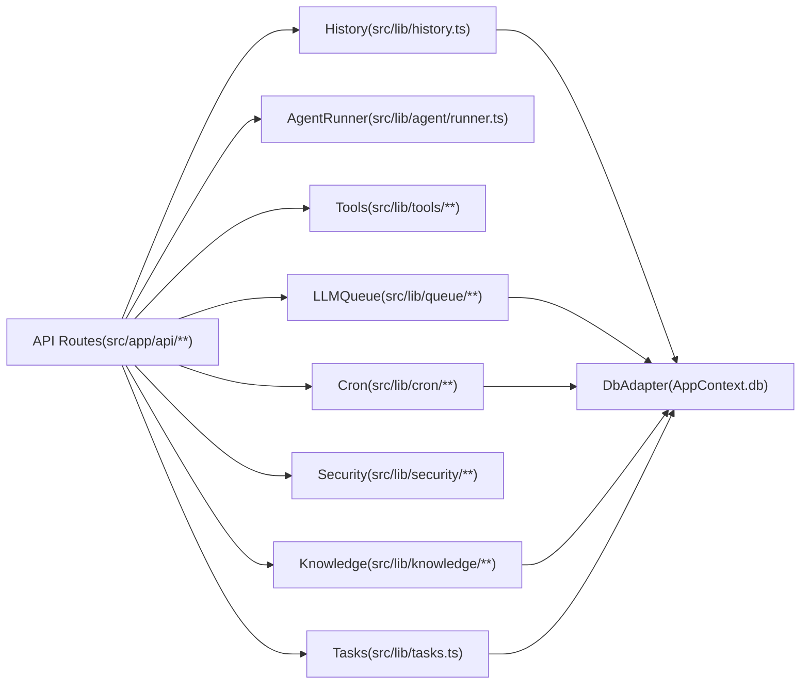

## Backend and Domain Architecture

This document explains how Maia’s **server-side architecture** works: how Next.js API routes obtain the `AppContext`, how they call into domain libraries under `src/lib/**`, how the database and background workers are accessed, and how all of this shows up as HTTP and SSE responses to the UI.

### AppContext and instrumentation

The **`AppContext`** is the central dependency-injection container that all backend code uses instead of importing global singletons.

- **Definition**: `src/lib/context.ts`
  - `AppContext` contains:
    - `db: DbAdapter` – structural wrapper around `better-sqlite3` (used in `src/lib/db.ts`).
    - `fs: FileSystemAdapter` – Node filesystem adapter.
    - `http: HttpClient` – long-timeout HTTP client (Undici) for Ollama, Brave, OpenRouter, etc.
    - `events: EventBus` – in-process event bus used to feed `/api/events`.
    - `processRunner: ProcessRunner` – runs shell commands (e.g., `docker exec`) for the terminal tool.
    - Optional browser helpers (`launchOneOffBrowser`, `getBrowserPage`) for web tools.
    - Optional `sandboxContainerName` (e.g., `maia-sandbox`).
  - Production implementations:
    - `makeNodeFsAdapter()` – wraps Node’s `fs` module.
    - `makeNativeFetchClient()` – wraps Undici with long timeouts for model calls.
    - `makeNodeProcessRunner()` – wraps `child_process.exec`.

The `AppContext` is created once per Node.js process via **instrumentation**:

- **`src/instrumentation.ts`**
  - Exposes:
    - `getAppContext()` – returns the already-initialized context or throws if not initialized.
    - `ensureAppContext()` – lazily initializes the context by calling `register()` if needed.
  - `ensureAppContext()`:
    - If `_appCtx` exists, and `NEXT_RUNTIME === "nodejs"`, imports `tickQueueProcessor` from `src/instrumentation-node.ts` and runs it once.
    - If `_appCtx` does not exist, calls `register()` which imports `registerNode()` and assigns `_appCtx`.

- **`src/instrumentation-node.ts`**
  - Provides `registerNode()` which:
    - Calls `getDb()` from `src/lib/db.ts` to open `data/maia.db` and run `initSchema`.
    - Creates a concrete `AppContext` by calling:
      - `makeNodeFsAdapter()`, `makeNativeFetchClient()`, `makeNodeProcessRunner()`.
      - Imports `globalEventBus` from `src/lib/events.ts`.
    - Initializes Maia’s core services:
      - `initMaiaAgent(ctx)` – registers Maia’s agent definition.
      - Creates `runAgentFn` wrapper around `runAgent` from `src/lib/agent/runner.ts`.
      - `initMessagingService(ctx, runAgentFn)` – enables `message_send` between agents and to user.
      - `registerLlmQueueHandlers()` from `src/lib/queue/llm-queue-handlers.ts`.
      - Starts the LLM queue processor and ticks it immediately.
      - Starts the cron scheduler via `startCronScheduler(ctx, runAgentFn)` from `src/lib/cron/service.ts`.

### API route lifecycle

Most API routes follow a common pattern:

1. Obtain an `AppContext` via `ensureAppContext()` or `getAppContext()`.
2. Call into domain modules under `src/lib/**` to do the actual work. **API routes do not use `ctx.db` directly;** they use domain modules that accept `AppContext` (e.g. `src/lib/history.ts`, `src/lib/tasks.ts`, `src/lib/security/credential-vault.ts`). This keeps business logic and data access in one place and makes routes thin and testable.
3. Shape and return a JSON (or SSE) response to the client.

**Error handling:** Routes must not let unhandled exceptions reach the framework. Wrap route logic in try/catch (or a shared wrapper). Map validation failures (e.g. Zod) to 400, not-found to 404, domain/security errors to 400 or 403, and unexpected errors to 500 with a generic message (log the real error server-side). JSON error responses use the standard shape `{ error: string; code?: string }`; see [API Endpoints](../api/endpoints.md#error-responses). A small helper `apiError(message, status, code?)` in `src/lib/api-response.ts` can be used to build these responses so the contract stays consistent.

#### Example: `/api/chat` (streamed chat)

`src/app/api/chat/route.ts`:

- Parses the request body with Zod:
  - `{ message: string; sessionId?: string; targetAgent?: string }`.
- Calls `ensureAppContext()` to get `ctx: AppContext`.
- Resolves or creates a session via history helpers:
  - `getActiveSessionId(ctx)`, `createSession(ctx, ["user", agentId])`, `setActiveSessionId(ctx, sessionId)`.
- Constructs a `ReadableStream` of SSE events.
- Inside `ReadableStream.start`:
  - Creates a local SSE `send(event: SSEEvent)` helper.
  - Defines a `runAgentFn` wrapper that calls `runAgent(ctx, createProvider, agentId, sessionId, message, () => {}, options)`.
  - Calls `initMessagingService(ctx, runAgentFn)` so tools like `message_send` work in this process.
  - Calls `runAgent(ctx, createProvider, agentId, sessionId, body.message, send, { emitHistoryEntries: true, queueCaller: "user" })`.
  - Streams `smart_context_phase`, `thinking`, `token`, `tool_call`, `tool_result`, and `done` events to the browser.

**Smart context and prompt:** The agent system prompt no longer includes the last N conversation rounds verbatim; relevant prior context is supplied via the smart context pipeline. Query extraction uses only the **clarified commands** for the chat (not full round content); the agent can use the **chat_read** tool with specific round numbers (e.g. `rounds: [1, 2]`) when it needs full context for those rounds. Smart context progress is streamed as `smart_context_phase` events (queries, retrieval, filter, summary, done) so the client can show live status (e.g. "Extracting queries…", "Done (5 sources)").

**Clarified command:** The runner rewrites the user message with a context model to resolve references and ambiguous terms; the clarified message **includes the actual context** (e.g. the exact terminal command, error text) when the user refers to "those commands" or "that error", not vague phrases like "the commands you were trying to run earlier". The model receives optional "Recent round detail" (tool calls, agent excerpt) to inline. The server emits the user history entry (with `resolvedContent` and `roundIndex`) via the event bus; the client merges this into the optimistically added user bubble so the clarified command appears in the UI without a refresh.

**Rounds and reasoning:** The **chat_read** tool requires specific 1-based round number(s) (e.g. `chat_read({ rounds: [1, 2] })`); it does not take "last N rounds". By default reasoning/thinking entries are omitted; the agent can pass `include_reasoning: true` to include the agent's reasoning for those rounds.

The full lifecycle for a chat request looks like this:

#### Example: `/api/tasks` (CRUD over tasks)

`src/app/api/tasks/route.ts`:

- `GET /api/tasks`:
  - Calls `ensureAppContext()` to get `ctx`.
  - Reads query params (`status`, `assignedTo`, `createdBy`) and calls `listTasks(ctx, { status, assignedTo, createdBy })` from `src/lib/tasks.ts`.
  - Returns `{ tasks }` as JSON.
- `POST /api/tasks`:
  - Calls `ensureAppContext()`.
  - Parses request body with Zod: `{ title, description?, assignedTo? }`.
  - Calls `createTask(ctx, { title, description, assignedTo })` from `src/lib/tasks.ts`. The task service generates id and timestamps, inserts into `tasks`, emits `tasks_changed`, and returns the created `Task`.
  - Returns the created task as JSON.

The task service (`src/lib/tasks.ts`) encapsulates all task CRUD and event emission; routes never touch `ctx.db` for tasks.

#### Example: `/api/credentials` (credential vault)

`src/app/api/credentials/route.ts`:

- Uses `getAppContext()` (no async initialization needed here).
- `GET /api/credentials`:
  - Calls `credentialList(ctx)` from `src/lib/security/credential-vault.ts` to return only credential keys (never values).
- `POST /api/credentials`:
  - Parses `{ key, value }` with Zod.
  - Calls `credentialCreate(ctx, key, value)`:
    - Encrypts the value with AES‑256‑GCM using `CREDENTIAL_MASTER_KEY`.
    - Stores iv, tag, ciphertext in the `credentials` table.

#### Example: `/api/cron/jobs` (cron inspection)

`src/app/api/cron/jobs/route.ts`:

- Uses `getAppContext()` to access `ctx.db`.
- Selects from `cron_jobs` and maps rows to `CronJob` objects with:
  - `describeCronSchedule(expression)` and `getNextCronRun(expression)` from `src/lib/cron/describe.ts`.
- Returns `{ jobs: CronJob[] }` JSON.

### Domain modules overview

The **domain layer** lives entirely under `src/lib/**`. API routes should treat it as their primary dependency surface.

Key modules:

- **Tasks (`src/lib/tasks.ts`)**
  - Task CRUD and event emission:
    - `listTasks(ctx, filters)` – list/filter tasks.
    - `createTask(ctx, input)` – create task, emit `tasks_changed`, return `Task`.
    - `getTask(ctx, id)` – get one task or null.
    - `updateTask(ctx, id, partial)` – update task, emit `tasks_changed`, return updated `Task`.
    - `deleteTask(ctx, id)` – delete task, emit `tasks_changed`.
  - Uses `tasks` table via `ctx.db` and `ctx.events`. Task tools in `src/lib/tools/**` call these functions via `ToolContext` (which exposes the same `ctx`).

- **History (`src/lib/history.ts`)**
  - Manages sessions and history entries:
    - `createSession`, `getActiveSessionId`, `setActiveSessionId`.
    - `getSession`, `appendEntry`, `ensureSession`.
  - Uses `sessions`, `history_entries`, `active_session` tables in `data/maia.db` via `ctx.db`.

- **Agent runner (`src/lib/agent/runner.ts`)**
  - Implements the core agentic loop (`runAgent` and `_runLoop`):
    - Loads agent identity (`getAgentIdentity`) and validates models against settings.
    - Builds system prompt including security preamble (`SECURITY_PREAMBLE`), AGENTS/SOUL, and matched skills.
    - Computes recent thread block and smart context via `buildSmartContextBlock`.
    - Builds LLM messages with `transformContext` and `convertToLlm`.
    - Drives the loop of:
      - LLM completion (tokens streamed via `onEvent`).
      - Tool calls and results (`getToolsForAgent`, registry under `src/lib/tools/registry.ts`).
      - History appends (`appendEntry`) and indexing jobs (`scheduleHistoryIndex` via `queue/llm-queue.ts`).
    - Emits SSE-like events (`AgentLoopEvent`) consumed by API routes via the `onEvent` callback.

- **Tools (`src/lib/tools/**`)\*\*
  - Implementations of the tool interface documented in `docs/architecture/tools.md`:
    - File tools (workspace, knowledge, tools).
    - Terminal and pipeline tools.
    - Web and browser automation.
    - Messaging, credentials, history, cron tools.
  - Tools receive a `ToolContext` that is built from `AppContext` plus agent/session metadata; all I/O goes through adapters.

- **Queue (`src/lib/queue/llm-queue.ts` and `llm-queue-handlers.ts`)**
  - Provides a priority job queue:
    - `enqueue({ tool, args, caller }, getCtx)` to add jobs.
    - `registerLlmQueueHandlers()` to bind tool names to handlers.
    - `startQueueProcessor(intervalMs)` and `tickQueueProcessor()` for processing.
  - Used for:
    - History indexing jobs (`indexHistoryEntry`).
    - Smart-context background operations.

- **Cron (`src/lib/cron/**`)\*\*
  - `service.ts`:
    - `startCronScheduler(ctx, runAgentFn)` loads `cron_jobs` from DB and schedules them with `node-cron`.
    - Heartbeat job and per-agent run jobs.
  - `describe.ts`:
    - `describeCronSchedule` and `getNextCronRun` used by `/api/cron/jobs`.

- **Knowledge and embeddings (`src/lib/knowledge/**`)\*\*
  - Knowledge base (files under `data/knowledge/`), history vectors (`history_vectors`), and vector search.
  - Utilities for building smart context and semantic search surfaces.

- **Security (`src/lib/security/**`)\*\*
  - `injection-filter.ts` – sanitizes untrusted text before exposing it to the LLM.
  - `credential-vault.ts` – encrypts/decrypts credentials via the `credentials` table.
  - Records security events in `security_events`.

### Mapping API routes to domain functions

The table below links a sample of key routes to the domain modules they primarily invoke.

| Route / File                              | Primary domain modules                                                                                   | Notes                                                                                               |
| ----------------------------------------- | -------------------------------------------------------------------------------------------------------- | --------------------------------------------------------------------------------------------------- |
| `/api/chat` (`src/app/api/chat/route.ts`) | `src/lib/history.ts`, `src/lib/agent/runner.ts`, `src/lib/ai/factory.ts`, `src/lib/messaging-service.ts` | Streams SSE events while running an agent with `runAgent`. Uses history helpers to manage sessions. |
| `/api/sessions/*`                         | `src/lib/history.ts`                                                                                     | Lists, creates, and updates sessions; fetches compressed/original history.                          |
| `/api/history/search`                     | `src/lib/history.ts`                                                                                     | Performs fuzzy search across sessions via `searchAcrossSessions`.                                   |
| `/api/tasks`                              | `src/lib/tasks.ts`                                                                                       | CRUD over tasks via task service; service uses `ctx.db` and `ctx.events`.                           |
| `/api/agents`                             | `src/lib/agent/identity.ts`, `src/lib/data-dir.ts`                                                       | Manages agent definitions and identity files on disk.                                               |
| `/api/credentials`                        | `src/lib/security/credential-vault.ts`                                                                   | Uses the credential vault to create and list keys (values never leave the vault).                   |
| `/api/cron/jobs`                          | `ctx.db` (cron_jobs), `src/lib/cron/describe.ts`                                                         | Lists cron jobs with human-readable descriptions and next run time.                                 |
| `/api/cron/heartbeat`                     | `src/lib/heartbeat.ts`                                                                                   | Triggers the internal heartbeat tool to wake Maia and reconcile agent cron jobs.                    |
| `/api/queue`                              | `src/lib/queue/llm-queue.ts`                                                                             | Exposes a snapshot of queued jobs and their priorities.                                             |
| `/api/events`                             | `src/lib/events.ts` and `AppContext.events`                                                              | Bridges the event bus to an SSE stream consumed by the UI.                                          |

### How to extend or debug the backend

- To **add a new API route**:
  - Place a `route.ts` under `src/app/api/<name>/`.
  - Use `ensureAppContext()` or `getAppContext()` to obtain `ctx`.
  - Prefer calling into an existing domain module under `src/lib/**` (or create a new one there) rather than putting logic directly in the route.

- To **add or change domain behavior**:
  - Locate the relevant module under `src/lib/**` (agent, history, knowledge, tools, queue, cron, security).
  - Update or extend it with new functions that accept `AppContext`.
  - Add or update tests under `src/__tests__/lib/**` before changing behavior, so the architecture docs stay accurate.

- To **trace a request end-to-end**:
  - Start from the API route under `src/app/api/**`.
  - Follow calls into `src/instrumentation.ts` (for `AppContext`), then into the appropriate `src/lib/**` modules as outlined above.
  - Use the logging helpers (`agentDebug`, `agentError`) and queue/cron snapshots to see background processing when needed.
