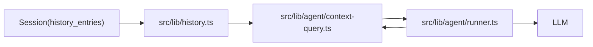

# Context Window Architecture

## Problem

Large language models have a finite context window. In a long-running agentic system with many sessions, tool calls, and agent interactions, naively including all history would quickly exhaust the available tokens.

## Solution: Dual-Layer History

Every exchange is stored in two forms:

| Layer          | Description                                                               | Token Cost                |
| -------------- | ------------------------------------------------------------------------- | ------------------------- |
| **Original**   | Verbatim content — full user message, full AI response, full tool results | High                      |
| **Compressed** | Semantically equivalent, stripped of all non-essential language           | Low (~10-30% of original) |

The same array index in `compressed[]` and `original[]` always refer to the same exchange.

## Context Assembly

When building the prompt for an AI call:

```
Token budget breakdown (example, 128k context model):
━━━━━━━━━━━━━━━━━━━━━━━━━━━━━━━━━━━━━━━━━━━━━━━━━━
System prompt + security preamble:       ~1,500 tokens
Agent identity (SOUL.md, AGENTS.md, skills): ~2,000 tokens
Compressed session history:             ~8,000 tokens  (would be ~40,000 uncompressed)
Current message (original, full):       ~2,000 tokens
Available tool definitions:             ~3,000 tokens
━━━━━━━━━━━━━━━━━━━━━━━━━━━━━━━━━━━━━━━━━━━━━━━━━━
Total:                                 ~16,500 tokens
Remaining for response:               ~111,500 tokens
```

### Context assembly and code paths

The flow below ties the token budget and context assembly to the modules that implement it. Session history (original and compressed) is read in `src/lib/history.ts`; system and recent-thread blocks are built in `src/lib/agent/context-query.ts` and used by `src/lib/agent/runner.ts`.



- **Session / history**: `getSession(ctx, sessionId)` returns `{ original, compressed }` arrays. Search query extraction uses only the **clarified commands** for the chat (Round 1: …, Round 2: …), not full rounds; the agent uses **find_tool** to discover how to read specific round numbers (e.g. `rounds: [1, 2]`) when it needs full context for those rounds. The last N rounds are still formatted with `formatRecentThreadTurns(session, n)` for the visible recent-thread block in the system prompt; they are not passed into query extraction. When reasoning/thinking is included (e.g. `chat_read` with `include_reasoning: true`), only the **most recent thinking entry per round** (in `formatRoundsByIndex`) or the single most recent in the slice (in `formatRecentThreadTurns`) is included so the context window is not filled by reasoning tokens.
- **transformContext**: In `src/lib/agent/context-query.ts`, `transformContext(recentThreadBlock, smartContextBlock, systemPromptContent)` combines the blocks into a single system string. The runner passes a recent-thread block (last N rounds) plus a note to use **find_tool** to discover how to read earlier rounds when more exist; prior context is also supplied via the smart context block.
- **convertToLlm**: Same module; maps that system string plus the user message (and optional initial tool result) to the `Message[]` format for the provider.
- **Runner**: `src/lib/agent/runner.ts` runs `buildEmbeddings(ctx)` (when Muninn is configured: knowledge index and history sync to Muninn) **before** smart context so retrieval sees current data; then calls `buildSmartContextBlock`, `buildSystemPrompt`, `transformContext`, and `convertToLlm` when building the prompt for each LLM request.
- **Semantic retrieval**: When the MuninnDB URL is set in Settings, smart context and the knowledge tool use **MuninnDB** only: `buildRawRetrievedContext` and `searchKnowledge` / `searchHistory` call Muninn’s ACTIVATE API; history entries and knowledge files are written to Muninn as engrams on append and on index. Without Muninn URL, semantic search returns no results.

## Compression Agent Behavior

The compression agent is a lightweight, fast model (e.g., `ollama/llama3.2` or similar small model). It is invoked **after** every exchange to compress the new entries.

### Input format sent to compression agent

```
You are a compression agent. Convert the following exchange into a compressed form.
Rules:
- Remove all greetings, affirmations, pleasantries, filler words
- Remove conversational connectors ("Of course!", "Great!", "Sure, let me...")
- Preserve ALL: facts, decisions, code, file paths, errors, numbers, names
- Code blocks: preserve verbatim (only strip non-essential comments)
- Prose: convert to terse bullet points or key-value facts
- Tool calls: preserve tool name, args, and result summary
- Never invent data. Never infer unstated facts.
- Output: valid JSON matching the HistoryEntry schema

EXCHANGE TO COMPRESS:
<original JSON entries here>
```

### What gets compressed

| Content Type      | Before                                                                                                                                                               | After                                                |
| ----------------- | -------------------------------------------------------------------------------------------------------------------------------------------------------------------- | ---------------------------------------------------- |
| User greeting     | "Hey Maia, hope you're doing well! Could you possibly help me set up a new Python project?"                                                                          | "User: set up new Python project"                    |
| Agent affirmation | "Of course! I'd be happy to help you get started. Let me think through what we'll need..."                                                                           | _(removed entirely)_                                 |
| File operation    | Full file contents echoed back in confirmation                                                                                                                       | `file_write: /workspace/main.py [success]`           |
| Error             | Full stack trace in prose                                                                                                                                            | `error: ModuleNotFoundError 'requests' at main.py:3` |
| Code              | Preserved verbatim                                                                                                                                                   | Preserved verbatim                                   |
| Decision          | "After considering the options, I think we should go with approach B because it aligns better with our architecture and will be easier to maintain in the long run." | `decision: approach B (architecture alignment)`      |

## Searching History

The `find()` and `get()` functions use fuzzy string matching against compressed content by default. Because compressed entries are structured (key-value, bullet points), search is more precise than searching prose.

Fuzzy matching implementation:

- Tokenize the query into keywords
- Score each entry by keyword coverage
- Return entries above a configurable threshold score

## Session Tags

The compression agent also assigns tags to the session. Tags are:

- Technology names: `python`, `docker`, `sqlite`
- Domain: `file-management`, `web-scraping`, `code-generation`
- Status: `in-progress`, `completed`, `blocked`
- Agent names involved: `maia`, `agent_007`

Tags are used by `find_tags()` to locate relevant sessions across the knowledge base without a full-text scan.
