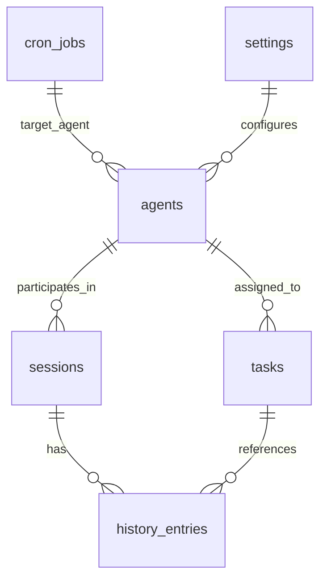

## Data Model (SQLite Schema)

Maia stores all long-lived state in a single **SQLite database** at `getDataDir()/maia.db` (default `data/maia.db` when running from project root; see `src/lib/data-dir.ts`). The schema is defined and migrated in code by `initSchema` in `src/lib/db.ts`, using the `DbAdapter` interface from `src/lib/context.ts`.

This document describes the main tables, their relationships, and which parts of the system use them.

### High-level entity relationships

- **`sessions`** – conversational threads.
- **`history_entries`** – individual messages and tool calls in sessions, both original and compressed.
- **`agents`** – Orchestrator rows (Maia remains primary); delegated personas live under `defaults/personas/` + `data/personas/` rather than multiplying isolated identities.
- **`tasks`** – Kanban-style tasks attached to agents/users.
- **`cron_jobs`** – scheduled jobs that trigger tools/agents.
- **`settings`** – global configuration such as whitelisted models and heartbeat intervals.
- **`credentials`** – encrypted vault for secrets.
- **`knowledge_vectors`**, **`history_vectors`** – primary **semantic** store for knowledge files and history (see [Semantic memory and layered memory](#semantic-memory-and-layered-memory)).
- **`memory_registry`**, **`memory_episodes`**, **`memory_entities`**, **`memory_edges`**, **`session_compactions`** – structured layered memory (pre-prompt recall, cross-session episodes, graph links, session compaction metadata).
- **`security_events`** – logs of injection and security-related events.
- **`active_session`** – singleton row for the currently active user session.
- **`approved_tools`** – registered custom tools (proposed by agents, approved by Maia).
- **`schema_version`** – single row storing the current migration version and `applied_at` timestamp (see Schema evolution strategy below).

All schema creation and migrations occur inside `initSchema(db: DbAdapter)` in `src/lib/db.ts`. This function is called once when `getDb()` is first invoked from `src/instrumentation-node.ts`.

### Sessions and history

**Tables: `sessions`, `history_entries`, `active_session`**

- `sessions`
  - Columns:
    - `id TEXT PRIMARY KEY`
    - `name TEXT NOT NULL DEFAULT ''`
    - `description TEXT NOT NULL DEFAULT ''`
    - `participants TEXT NOT NULL DEFAULT '[]'` – JSON array of participant IDs (e.g., `["user", "maia"]`).
    - `default_persona_id TEXT` – optional catalog persona id: plain user messages in a user+Maia thread run as this persona until cleared (see `persona_set_session_default` tool).
    - `tags TEXT NOT NULL DEFAULT '[]'` – JSON array of tags assigned by the compression agent.
    - `type TEXT NOT NULL DEFAULT 'user'` – `"user"` or `"agents"`.
    - `created_at TEXT NOT NULL` – ISO timestamp.
    - `updated_at TEXT NOT NULL` – ISO timestamp.
  - Used by:
    - `src/lib/history.ts` – session management.
    - `/api/sessions/*` routes.
    - Agent orchestration (e.g., agent-to-agent sessions).

- `history_entries`
  - Columns:
    - `id TEXT PRIMARY KEY`
    - `session_id TEXT NOT NULL REFERENCES sessions(id) ON DELETE CASCADE`
    - `role TEXT NOT NULL` – `"user"`, `"agent"`, `"system"`, `"tool_call"`, `"thinking"`, `"smart_context"`, etc.
    - For `role = "smart_context"`: UI-only; `content` is JSON of a smart context run (phases + result). Excluded from prompt building and round selection via `entriesForConversation()`; included when loading session for the UI so the latest run is shown after refresh.
    - `content TEXT NOT NULL` – full (or compressed) content.
    - `resolved_content TEXT` – clarified command for user entries (ambiguous terms and references to prior rounds resolved; meaning and structure preserved).
    - `round_index INTEGER` – numeric round index per user turn.
    - `tool_name TEXT` – for tool calls.
    - `tool_args TEXT` – JSON string of tool arguments.
    - `timestamp TEXT NOT NULL`
    - `is_compressed INTEGER NOT NULL DEFAULT 0` – 0 for original, 1 for compressed.
    - `speaker_id TEXT`, `speaker_label TEXT`, `persona_id TEXT` – optional attribution for `role = "agent"` (or related rows) so the unified transcript can show **who** spoke (Maia, a persona id, or another agent id).
  - Indexes:
    - `idx_history_session(session_id, is_compressed)`
  - Used by:
    - `src/lib/history.ts` – read/write history.
    - `src/lib/agent/runner.ts` – appends user, tool, thinking, and agent entries.
    - `src/lib/knowledge/history-index.ts` – embeds entries into `history_vectors` (skips `thinking` and `smart_context` roles).

- `active_session`
  - Columns:
    - `singleton INTEGER PRIMARY KEY DEFAULT 1 CHECK(singleton = 1)`
    - `session_id TEXT`
  - Seeded with a single row by `INSERT OR IGNORE INTO active_session (singleton, session_id) VALUES (1, NULL)`.
  - Used by:
    - `src/lib/history.ts` – get/set active session.
    - `/api/sessions/active` and `/api/chat` routes.

### Agents

**Table: `agents`**

- Columns:
  - `id TEXT PRIMARY KEY`
  - `name TEXT NOT NULL`
  - `model TEXT NOT NULL` – model identifier (e.g., `ollama/llama3.2`).
  - `status TEXT NOT NULL DEFAULT 'active'` – runtime status for UI (`"active"`, `"paused"`, etc.).
  - `system_prompt_extra TEXT` – additional system instructions.
  - `created_at TEXT NOT NULL`
  - `updated_at TEXT NOT NULL`
  - `reasoning_effort TEXT NOT NULL DEFAULT 'medium'` – added via migration; controls reasoning intensity for some models.
- Used by:
  - `src/lib/agent/identity.ts` – load/store agent records.
  - `src/lib/agent/runner.ts` – validate whitelisted models and reasoning effort.
  - `/api/agents/*` routes and Agents UI.

### Credentials (vault)

**Table: `credentials`**

- Columns:
  - `key TEXT PRIMARY KEY`
  - `iv TEXT NOT NULL` – base64 IV for AES‑256‑GCM.
  - `tag TEXT NOT NULL` – base64 auth tag.
  - `ciphertext TEXT NOT NULL` – base64 encrypted value.
  - `created_at TEXT NOT NULL`
  - `updated_at TEXT NOT NULL`
- Used by:
  - `src/lib/security/credential-vault.ts` – encrypt/decrypt values using `CREDENTIAL_MASTER_KEY`.
  - `/api/credentials` routes – list keys and create/update/delete credentials.
  - Web tools – internal `credential_get` (not exposed to the LLM) to retrieve values for API calls.

### Settings

**Table: `settings`**

- Columns:
  - `key TEXT PRIMARY KEY`
  - `value TEXT NOT NULL`
- Seeded in `initSchema` with defaults such as:
  - `heartbeatIntervalMinutes`
  - `ollamaBaseUrl`
  - `ollamaApiKey`, `openRouterApiKey`
  - `embeddingModel`, `embedMaxContentLength`
  - `contextRecentTurns`, `contextReasoningEffort`
  - Archive duration configuration
- Used by:
  - `src/lib/settings.ts` – typed access to settings.
  - `src/lib/agent/runner.ts` – context models and reasoning effort.
  - `src/lib/heartbeat.ts` and `src/lib/cron/**` – scheduling behavior.
  - `/api/settings` routes and Settings UI.

### Cron jobs and scheduling

**Table: `cron_jobs`**

- Columns:
  - `id TEXT PRIMARY KEY`
  - `expression TEXT NOT NULL` – cron expression (`* * * * *`).
  - `task_description TEXT NOT NULL` – human description.
  - `agent_id TEXT NOT NULL` – target agent.
  - `is_built_in INTEGER NOT NULL DEFAULT 0` – built-in vs user-defined.
  - `created_at TEXT NOT NULL`
  - `tool_name TEXT NOT NULL DEFAULT 'cron_echo'` – tool to invoke when job fires.
  - `tool_args TEXT NOT NULL DEFAULT '{}'` – JSON of tool args.
- Migrations:
  - `tool_name` and `tool_args` are added via `ALTER TABLE` if missing, with a backfill:
    - `UPDATE cron_jobs SET tool_args = json_object('message', task_description) WHERE tool_args = '{}'`.
- Used by:
  - `src/lib/cron/service.ts` – schedules jobs and fires tools/agents.
  - `src/lib/heartbeat.ts` – heartbeat job and per-agent run jobs.
  - `/api/cron/jobs` route and Cron UI.

### Security events

**Table: `security_events`**

- Columns:
  - `id TEXT PRIMARY KEY`
  - `agent_id TEXT NOT NULL`
  - `session_id TEXT NOT NULL`
  - `event_type TEXT NOT NULL` – e.g., `"injection_detected"`.
  - `detail TEXT NOT NULL` – JSON payload with pattern, source, and original length.
  - `occurred_at TEXT NOT NULL`
- Used by:
  - `src/lib/security/injection-filter.ts` – logs redacted content.
  - Future security dashboards or audits.

### Semantic memory and layered memory

**Vector semantic memory:** Knowledge index and history index write to **`knowledge_vectors`** and **`history_vectors`** using the configured embedder. Smart context and knowledge/history search read from the same tables. `thinking` entries are not embedded. See [Runtime and operations](runtime-and-ops.md#layered-memory-and-semantic-search-sqlite).

**Tables: `knowledge_vectors`, `history_vectors`**

- `knowledge_vectors`: id, path, content, content_hash, embedding_json, updated_at. File content is truncated/chunked to the effective embed context length before embedding.
- `history_vectors`: id, session_id, entry_id, content, embedding_json, is_compressed, created_at; index on session_id. Long entries are chunked; one row per chunk (same entry_id). Search returns at most one hit per entry_id (the highest-scoring chunk).

**Tables: layered memory (SQLite)**

- `memory_registry` – pre-prompt “cards” with embeddings, quality, dedupe hash, access stats (`src/lib/memory/registry.ts`).
- `memory_episodes` – cross-session summaries with embeddings and optional source entry id list (`src/lib/memory/graph.ts`).
- `memory_entities`, `memory_edges` – simple graph for episodes and linking (`src/lib/memory/graph.ts`).
- `session_compactions` – session-local compaction summaries and source entry id lineage (`src/lib/memory/compaction.ts`).

**On-disk PARA** lives under `data/agents/<agent_id>/life/` (hierarchy with `items.json` / `summary.md` per leaf); not stored as separate SQL tables. **Daily notes** are dated markdown under the agent data directory (see `src/lib/memory/daily-notes.ts`).

### Tasks and approved tools

**Tables: `tasks`, `approved_tools`**

- `tasks`
  - Columns:
    - `id TEXT PRIMARY KEY`
    - `title TEXT NOT NULL`
    - `description TEXT NOT NULL DEFAULT ''`
    - `status TEXT NOT NULL DEFAULT 'todo'` – `"todo"`, `"in_progress"`, `"done"`, etc.
    - `created_by TEXT NOT NULL` – usually `"user"` or an agent ID.
    - `assigned_to TEXT` – agent ID or `NULL`.
    - `created_at TEXT NOT NULL`
    - `updated_at TEXT NOT NULL`
    - `notes TEXT NOT NULL DEFAULT '[]'` – JSON array of `TaskNote` objects.
  - Indexes:
    - `idx_tasks_status(status)`
    - `idx_tasks_assigned(assigned_to)`
  - Used by:
    - `/api/tasks` routes and Tasks UI.
    - Agents via task tools (`task_create`, `task_update`, etc.).
    - Heartbeat and agent scheduling logic (Maia assigns tasks and cron jobs).

- `approved_tools`
  - Columns:
    - `tool_slug TEXT PRIMARY KEY`
    - `approved_at TEXT NOT NULL`
  - Used by:
    - `src/lib/tools/registry.ts` – decides which custom tools are visible to agents.
    - Tool approval workflow (Maia-only tools `approve_tool`, `tool_deregister`).

### Schema evolution strategy

Maia uses **code-driven migrations** inside `initSchema` in `src/lib/db.ts`. A **schema version table** records which migrations have been applied so that:

- There is a clear history of what ran (version number and `applied_at` timestamp).
- New migrations are added as ordered steps and run only when the current version is below the step number.
- The schema definition stays co-located with the application code (no separate migration framework).

**Schema version table:** `schema_version (version INTEGER PRIMARY KEY, applied_at TEXT NOT NULL)`. It holds a single row; `version` is the highest migration step that has been applied (0 = baseline, no step run yet).

**Flow:**

1. Create all base tables with `CREATE TABLE IF NOT EXISTS ...`, including `schema_version`. Seed the version row with `INSERT OR IGNORE INTO schema_version (version, applied_at) VALUES (0, ...)` so a new database starts at version 0.
2. Run the migration runner: read current `version` from `schema_version`. For each migration step `N` (1, 2, 3, …), if `currentVersion < N`, run the step (e.g. `ALTER TABLE`, backfill), then `UPDATE schema_version SET version = N, applied_at = datetime('now')`.
3. Future schema changes: add a new step at the next integer (e.g. step 4), implement it in code, and document it in this section.

**Existing migrations** include, among others: cron job tool columns; agents `reasoning_effort`; history `resolved_content` / `round_index`; Muninn settings key removal (step 7); layered memory tables `memory_registry`, `memory_episodes`, `memory_entities`, `memory_edges`, `session_compactions` (step 8).

When you add a new migration:

- Add a new step in `src/lib/db.ts` (or a dedicated `src/lib/db/migrations.ts` if the file grows large).
- Update this "Schema evolution strategy" section with a short note (e.g. "Step N: add column X to table Y").
- Update domain modules and tests that depend on the schema.

### Where to look next

- For how this schema is used in practice:
  - See `docs/architecture/backend-and-domain.md` for how API routes and domain libraries interact with the DB.
  - See `docs/architecture/context-window.md` and `docs/architecture/agent-system.md` for how sessions and history entries map to the agent context window.
  - See `docs/architecture/tools.md` for how tools persist data in tasks, knowledge, and security-related tables.
