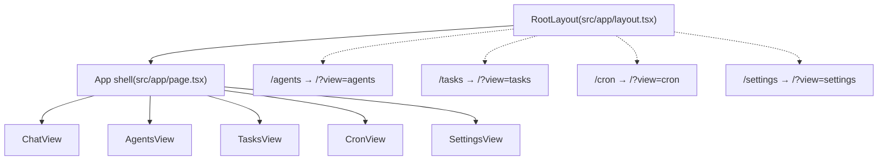
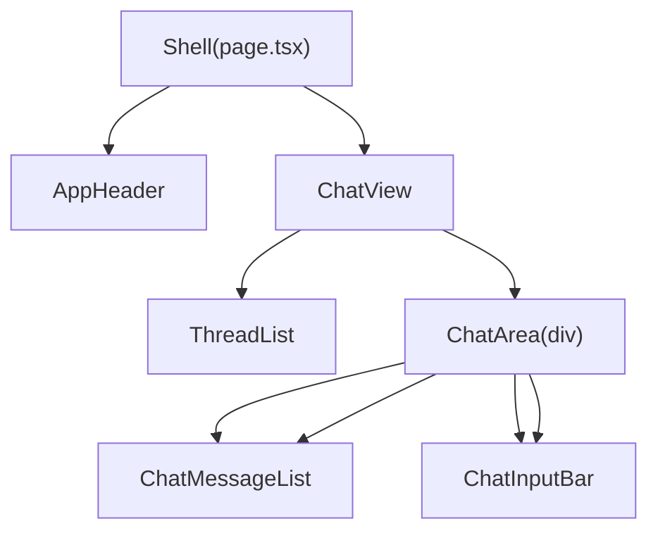
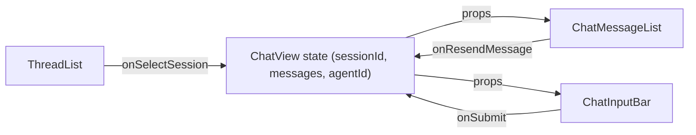
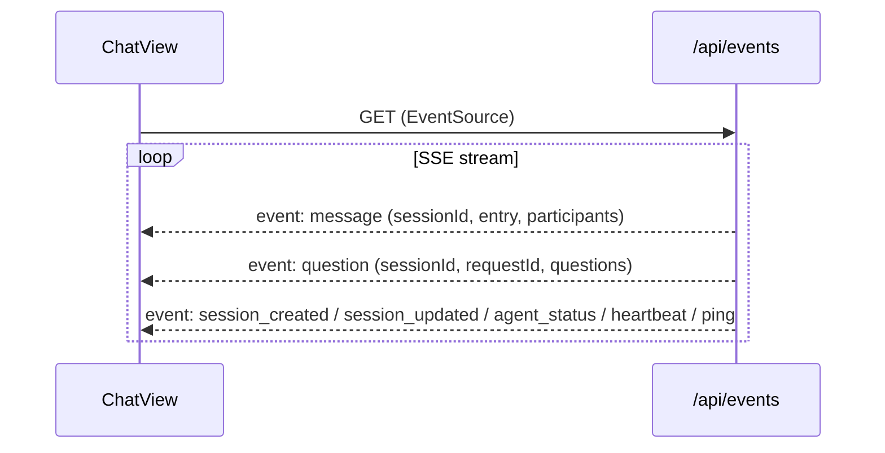

## Frontend Architecture

This document explains how the Maia **Next.js 16 App Router UI** is structured: routes, shared components, and how state and data flow through the main chat experience and supporting pages.

- Framework: **Next.js 16.1.x App Router** with React 19.
- Styling: **Tailwind CSS 4** via `globals.css` and utility classes.
- Entry point: `src/app/layout.tsx` (root layout) and `src/app/page.tsx` (home/chat page).
- Shared components: `src/app/components/**`.

### Routes and pages

The UI uses a **single app shell** at `/` that shows one of five views at a time by visibility (`hidden`). All view components stay mounted so switching tabs does not lose state. Routes `/agents`, `/tasks`, `/cron`, and `/settings` redirect to `/?view=agents`, `/?view=tasks`, etc.

- **Root layout (`src/app/layout.tsx`)**
  - Declares `<html>` / `<body>`, global fonts, and imports `./globals.css`.
  - Wraps all routes; the shell or redirects render inside its `<body>`.

- **App shell (`src/app/page.tsx`)**
  - Client component that reads `?view=` from the URL (default `chat`).
  - Renders a single `AppHeader` with tab links to `/?view=...` (or `/` for chat).
  - Renders all five views in the same tree; only the active view is visible (`hidden` and `aria-hidden` on the others). Views are never unmounted, so form state and data are preserved when switching tabs.
  - View components live under `src/app/views/`: `ChatView`, `AgentsView`, `TasksView`, `CronView`, `SettingsView` (Settings uses `SettingsContent` from `src/app/settings/SettingsContent.tsx` with `hideHeader`).

- **Redirect pages**
  - `src/app/agents/page.tsx`, `tasks/page.tsx`, `cron/page.tsx`, `settings/page.tsx` each redirect to `/?view=...` so deep links and bookmarks still work.

- **Views (content only; no header)**
  - **ChatView**: thread list, message list, input; subscribes to `/api/events`.
  - **AgentsView**: agent monitor (status, task counts, recent activity, cron summary).
  - **TasksView**: Kanban task board.
  - **CronView**: list and edit scheduled jobs.
  - **SettingsView**: wraps `SettingsContent` (providers, models, context, agents, skills) with `hideHeader`.

See the tests under `src/__tests__/app/**` for examples of how these pages are rendered and wired.

### Main chat component tree

The app shell in `src/app/page.tsx` renders `ChatView` (from `src/app/views/ChatView.tsx`) when `?view=chat` or no view param. `ChatView` composes the main chat UI out of shared components under `src/app/components`.

- **`ChatView` (`src/app/views/ChatView.tsx`)**
  - Declares chat‑level state:
    - `messages: ChatMessageListItem[]`
    - `input: string`
    - `sessionId: string | null`
    - `sessionType: "user" | "agents"`
    - `currentAgentId: string | null`
    - `loading: boolean`
    - `currentToken: string`
    - `currentThinking: string`
    - `threadListRefetch: number` (to cause `ThreadList` to reload)
  - Uses refs to coordinate with streaming and SSE:
    - `sessionIdRef`, `loadingRef`, `currentAgentIdRef`, `thinkingAccumulatorRef`, `bottomRef`.

- **`AppHeader` (`src/app/components/AppHeader.tsx`)**
  - Renders the top bar with app title and subtitle (e.g. `"AI Agent System"`). Also embeds `QueueListMonitor` and `OllamaPerformanceMonitor` for queue and Ollama status.

- **`ThreadList` (`src/app/components/ThreadList.tsx`)**
  - Sidebar listing sessions (threads) from `/api/sessions`.
  - Receives callbacks:
    - `onSelectSession(id)` → calls `loadSession(id)` in `ChatView`.
    - `onNewThreadWithAgent(agentId)` → creates a new user session in `ChatView`.
    - `onThreadDeleted(id)` → notifies `ChatView` so it can reset state if the active session is removed.
  - Uses `refetchTrigger` to decide when to re‑fetch session metadata.

- **`ChatMessageList` (`src/app/components/ChatMessageList.tsx`)**
  - **Universal bubble rendering**: Receives a single `messages` array of `ChatMessageListItem` (discriminated by `role`). Iterates once and, for each item, chooses the bubble component by `role`. Extensible: new bubble types add one role variant and one branch in the render loop. No special-case props for specific bubble types.
  - Receives: `messages` (flat list in display order; ChatView merges conversation items with synthetic items e.g. `role: "smart_context"` at the right index; user messages can carry `conversationIndex` for edit/truncate), `currentToken`, `currentThinking`, `loading`, `bottomRef`, optional `onEditMessage(conversationIndex, content)`, `onUserInputAnswered`.
  - Renders one bubble per item by `role` (user, agent, system, tool, thinking, smart_context, user_input); user messages can carry `conversationIndex` for Edit/truncate.
    - User messages (`role: "user"`).
    - Agent messages (`role: "agent"`).
    - System messages (`role: "system"`).
    - Tool calls/results (`role: "tool"`).
    - Reasoning (`role: "thinking"`).
    - **Inline user-input bubbles** (`role: "user_input"`):
      - **Pending:** Render the shared `QuestionForm` used by `ask_user` as an inline bubble when the server emits a `question` SSE event (radios + “Other” field or free text).
      - **Answered:** Render a read-only Q&A summary (questions with their final answers). Answered bubbles are restored from history by mapping `ask_user` `tool_call` entries into `user_input` items.
  - Smart context is a `role: "smart_context"` item in the same list; the page inserts it after the triggering user message. Data comes from the session row; persistence and exclusion from conversation/embeddings unchanged.

- **`ChatInputBar` (`src/app/components/ChatInputBar.tsx`)**
  - Controlled input:
    - `value` (text).
    - `onChange` (setter).
    - `onSubmit` (send handler).
    - `disabled` (uses `loading` from `ChatView` to prevent duplicate sends).

### UI state and data flow on the home page

At a high level, the chat view keeps **authoritative state** in the `ChatView` component and passes it down as props.

#### Session loading

- `ChatView` defines `loadSession(id: string)`:
  - `PUT /api/sessions/active` to set the active session.
  - `GET /api/sessions/active` to fetch the new active session.
  - Updates:
    - `sessionId`
    - `sessionType`
    - `currentAgentId` (using `primaryAgentFromParticipants`)
    - `messages` (by mapping `HistoryEntry[]` to `ChatMessageListItem[]` via `entryToItem`).
- `ThreadList` calls `onSelectSession(id)`, and `ChatView` delegates to `loadSession`.

#### Session bootstrap

- On mount, `ChatView` calls `GET /api/sessions/active`:
  - If a session exists, it initializes `sessionId`, `sessionType`, `currentAgentId`, and `messages`.
  - Uses `setMessages` with a guard so that any in‑flight streaming messages are not overwritten by slow initial fetches.

#### Sending a message

`sendMessage` (defined in `ChatView`) drives the main chat request/response flow:

1. Validate and normalize input:
   - Use `overrideContent` if provided (for re‑send); otherwise use `input`.
   - Trim and early‑return if empty or `loading` is true.
2. Update local state:
   - Clear `input` (for new sends).
   - Set `loading = true`, `currentToken = ""`, `currentThinking = ""`.
   - Append an optimistic `{ role: "user", content: text }` message to `messages`.
3. Call the API:
   - `POST /api/chat` with JSON body:
     - `message: text`
     - `sessionId: sessionIdRef.current ?? undefined`
     - `targetAgent: currentAgentIdRef.current ?? "maia"`
   - Stream the response from `resp.body.getReader()` and feed lines to `processLine`.
4. Handle streamed events:
   - `thinking`: accumulate to `thinkingAccumulatorRef`, update `currentThinking`, and later flush as a discrete `"thinking"` bubble.
   - `token`: clear thinking, append content to `accumulated`, and update `currentToken`.
   - `tool_call`: append a `"tool"` bubble with name/args.
   - `tool_result`: update the latest `"tool"` bubble with the result.
   - `done`:
     - Update `sessionId` if provided.
     - Append a final `"agent"` message using the accumulated tokens (once).
     - Clear `currentToken` and bump `threadListRefetch` to refresh the sidebar.
   - `error`: append a `"system"` message, clear streaming state, and reset accumulators.
5. Finally, clear `loading` regardless of success or failure.

#### Editing and re-sending from history

- `ChatMessageList` exposes **Edit** on user bubbles when `onEditMessage` is provided. Editing is **inline**: clicking **Edit** switches that bubble to an inline editor (textarea with Save/Cancel) instead of moving focus to the input bar.
- `ChatView` passes `editingMessageIndex`, `onSaveEdit`, and `onCancelEdit` to `ChatMessageList`. It implements:
  - `handleEditMessage(index, _content)`: sets `editingMessageIndex = index` and clears the main input so the bubble shows the inline editor.
  - `handleSaveEdit(content)`: calls `sendMessage(content)` so the same truncate-and-append flow runs.
  - `handleCancelEdit()`: clears `editingMessageIndex`.
- When the user clicks **Save** in the inline editor, `sendMessage(editedContent)` runs:
  - If `sessionId` is set, it `POST`s `/api/sessions/{sessionId}/history/truncate` with `{ keepThroughIndex: index - 1 }` to drop the original message and everything after it.
  - It trims `messages` locally to `prev.slice(0, index)` and appends a new `{ role: "user", content }` entry with the edited text.

#### Autoscroll behavior

- A `bottomRef` is attached to the bottom of the chat area. The scroll container (the `div` with `overflow-y-auto`) has an `onScroll` handler that tracks whether the user is “at bottom” (within a small pixel threshold of the bottom).
- Auto-scroll runs only when the user is at the bottom. When the user scrolls up, auto-scroll stops until they scroll back to the bottom. This avoids pulling the view down while the user is reading older messages.
- `useEffect` in `ChatView` calls `bottomRef.current?.scrollIntoView({ behavior: "smooth" })` when `messages`, `currentToken`, or `currentThinking` change **and** the user is at the bottom (tracked via a ref updated synchronously in the scroll handler so the decision is correct even before React commits state).

#### Error and loading states

- **Loading:** The home page uses a single `loading` flag (and `loadingRef` for the stream handler). While `loading` is true, the send button is disabled and the UI can show a loading indicator. Streaming state (`currentToken`, `currentThinking`) is cleared when the stream ends or errors.
- **Stream errors:** When the chat stream emits an `error` event, `sendMessage` appends a `"system"` role message with the error text to `messages`, clears streaming state and accumulators, and then clears `loading`. The user sees the error inline in the chat rather than a blank or stuck screen.
- **API errors (non-stream):** For non-streaming API calls (e.g. session load, truncate), failures should be caught and either shown inline (e.g. toast or banner) or as a system message so the user is never left with an unexplained blank state. The exact pattern (toast vs inline) can be chosen per route; the important point is that every user-triggered request has a defined error path.
- **Error boundaries:** React error boundaries can be added around the main chat area or layout to catch render errors and show a fallback UI instead of a white screen. If present, document their placement here; if not yet added, consider adding one around the home chat surface and documenting it.

### Real-time updates via events

The UI maintains a **Server‑Sent Events (SSE)** subscription to `/api/events` to react to server‑side changes such as agent‑initiated messages.

- `ChatView` creates an `EventSource("/api/events")` on mount.
- On `message` events:
  - Parses the payload `{ sessionId, entry, participants }`.
  - Only processes the event if `payload.sessionId === sessionIdRef.current`.
  - Skips duplicates:
    - While `loadingRef.current` is `true`, it ignores `user` and `tool_call` echoes so the SSE stream does not double‑render the optimistic entries.
    - Deduplicates repeated user messages by comparing the content of the last user bubble.
  - Appends agent and system entries to `messages` as they arrive.
- On `question` events:
  - Parses the payload `{ sessionId, requestId, questions }`.
  - Only processes the event if `sessionId === sessionIdRef.current`.
  - Appends a `user_input` message to `messages` so the inline user-input bubble appears in the chat stream. When the user submits, the bubble calls `/api/chat/question-response` and the corresponding `user_input` item is updated to `status: "answered"` with the recorded answers.
- On `ping` events:
  - No UI update; used only to keep the connection alive.

### Agent-only threads

- `sessionType` is `"user"` for user‑centric threads and `"agents"` for agent‑only threads.
- When `sessionType === "agents"`:
  - `ChatView` renders a banner in the chat area indicating the thread is read‑only.
  - `ChatInputBar` is **hidden**, so the user cannot send messages directly.
  - `onResendMessage` is disabled so no replay is possible.

### How to explore and test the frontend

- **Source exploration**
  - Read `src/app/page.tsx` alongside:
    - `src/app/components/AppHeader.tsx`
    - `src/app/components/ThreadList.tsx`
    - `src/app/components/ChatMessageList.tsx`
    - `src/app/components/ChatInputBar.tsx`
  - Inspect `src/app/agents/page.tsx`, `src/app/tasks/page.tsx`, `src/app/cron/page.tsx`, and `src/app/settings/page.tsx` for supporting UIs.

- **Tests**
  - Page and component tests live under `src/__tests__/app/**`, for example:
    - `src/__tests__/app/page.test.tsx`
    - `src/__tests__/app/components/ChatMessageList.test.tsx` (and similar component tests)
  - Use these tests as executable documentation for expected props, state transitions, and rendering behavior described above.
