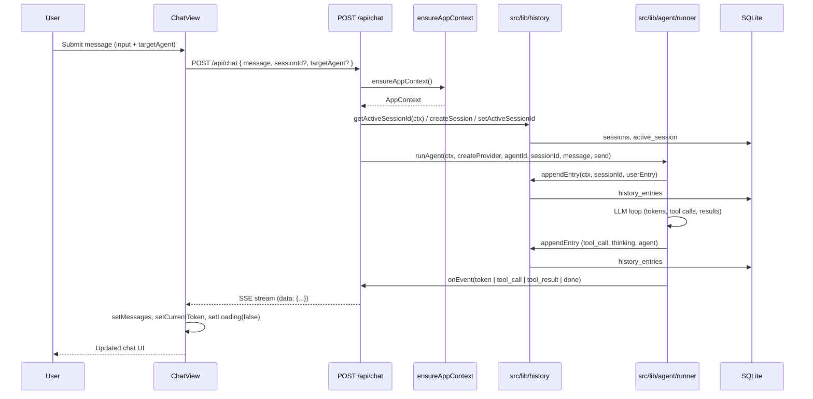
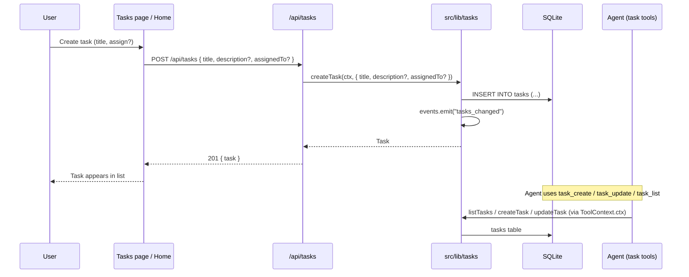
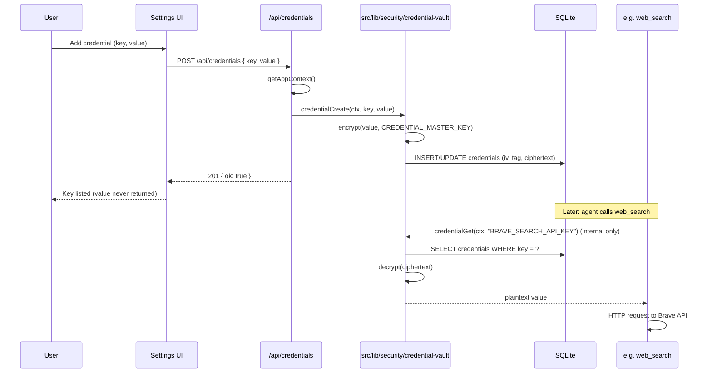
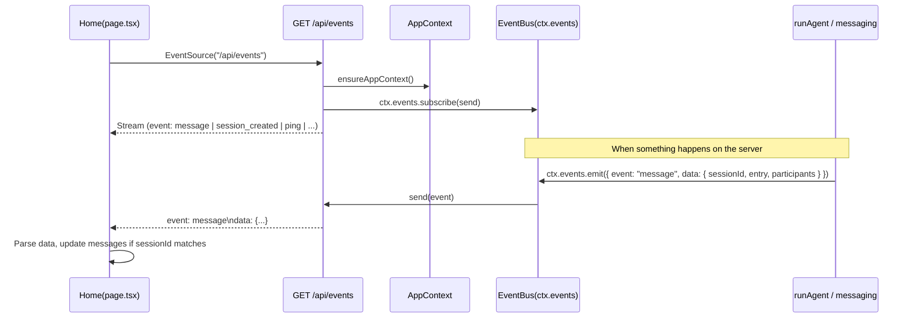

# Request Flows

This document captures **end-to-end flows** for the main user and system operations: how a request moves from the browser through API routes and domain code to the database and back, and how real-time events reach the UI. Each flow is tied to concrete handlers in `src/app/api/**` and domain code in `src/lib/**`.

## Chat message round-trip

From the user typing a message in the home page to the message and agent reply being stored and shown in the UI.

**Steps in code:**

1. **Chat view** (`src/app/views/ChatView.tsx`): `sendMessage()` builds the request body and calls `fetch("/api/chat", { method: "POST", body: JSON.stringify({ message, sessionId, targetAgent }) })`. It reads the response body as a stream and parses SSE lines to update `messages`, `currentToken`, `currentThinking`, and `loading`.
2. **Chat route** (`src/app/api/chat/route.ts`): Parses body with Zod, calls `ensureAppContext()`, resolves or creates session, then resolves catalog persona vs orchestrator (`resolveCatalogPersonaForUserMessage`: `@mention`, client `targetAgent` as catalog id, `sessions.default_persona_id` on user+Maia threads). Creates a `ReadableStream` and inside it calls `runAgent(...)` with optional `personaTurn`. The `send` callback enqueues SSE `data:` lines to the stream.
3. **Runner** (`src/lib/agent/runner.ts`): Appends user entry with `appendEntry`, runs the agentic loop (build context, call provider, execute tools, append tool/agent entries), and invokes `onEvent` for each token, tool_call, tool_result, and done. When `emitHistoryEntries` is true, it also emits `ctx.events.emit({ event: "message", data: { sessionId, entry, participants } })` so the events route can push to other clients.
4. **History** (`src/lib/history.ts`): `appendEntry` inserts into `history_entries`; session metadata lives in `sessions` and `active_session`.

See [Backend and Domain](backend-and-domain.md) and [Frontend Architecture](frontend-architecture.md) for more detail.

## Task lifecycle

How tasks are created and updated from the UI and how agents interact with them.

API routes do not use `ctx.db` directly; they call domain modules (e.g. `src/lib/tasks.ts`). The task service encapsulates all task CRUD and emits `tasks_changed` via `ctx.events`.

**Steps in code:**

1. **Tasks route** (`src/app/api/tasks/route.ts`):
   - **GET**: `ensureAppContext()`, then `listTasks(ctx, { status, assignedTo, createdBy })` from `src/lib/tasks.ts`. Returns `{ tasks }`.
   - **POST**: Parses body with Zod, then `createTask(ctx, { title, description, assignedTo })` from `src/lib/tasks.ts`. Returns the created task.
2. **Task by id** (`src/app/api/tasks/[id]/route.ts`): GET/PATCH/DELETE call `getTask(ctx, id)`, `updateTask(ctx, id, partial)`, `deleteTask(ctx, id)` from `src/lib/tasks.ts`.
3. **Agents**: Task tools in `src/lib/tools/**` call the same task service functions (e.g. `listTasks(ctx, {})`, `createTask(ctx, {...})`) via `ToolContext`; they do not use `ctx.db` directly for tasks.

See [Data Model](data-model.md) for the `tasks` table schema.

## Credential creation and use

How a credential is stored via the UI and later used by a tool (e.g. web search).

**Steps in code:**

1. **Credentials route** (`src/app/api/credentials/route.ts`): GET returns `credentialList(ctx)` (keys only). POST parses `{ key, value }` and calls `credentialCreate(ctx, key, value)` from `src/lib/security/credential-vault.ts`.
2. **Credential vault** (`src/lib/security/credential-vault.ts`): Encrypts the value with AES-256-GCM using `CREDENTIAL_MASTER_KEY`, stores iv, tag, and ciphertext in the `credentials` table. `credentialGet` is used only by internal tool code (e.g. web tools); it is not exposed to the LLM.
3. **Tools**: Web search and similar tools obtain API keys via the vault and use `AppContext.http` to call external APIs. See [Security](security.md) for the credential vault design.

## Events (SSE) flow

How the UI subscribes to server-sent events and how those events are produced.

**Steps in code:**

1. **Home** (`src/app/page.tsx`): On mount, creates `new EventSource("/api/events")`, listens for `message` (and other) events. For `message`, parses `data` as `{ sessionId, entry, participants }` and, if `sessionId === sessionIdRef.current`, appends the entry to `messages` (with deduplication for in-flight chat).
2. **Events route** (`src/app/api/events/route.ts`): `ensureAppContext()`, then creates a `ReadableStream` that subscribes to `ctx.events.subscribe(send)`. Each time the event bus emits (e.g. from the chat route or messaging service), `send` writes an SSE line `event: <event>\ndata: <json>\n\n`. A ping interval sends keep-alive every 15s. On request abort, the subscription is removed and the stream closed.
3. **Producers**: `runAgent` (when `emitHistoryEntries: true`) and the messaging service call `ctx.events.emit({ event: "message", data: { sessionId, entry, participants } })`. Other event types (e.g. `session_created`, `session_updated`, `tasks_changed`, `heartbeat`, `ping`) are documented in [API Endpoints](../api/endpoints.md).

See [Frontend Architecture](frontend-architecture.md) for how the home page uses EventSource and updates state.
