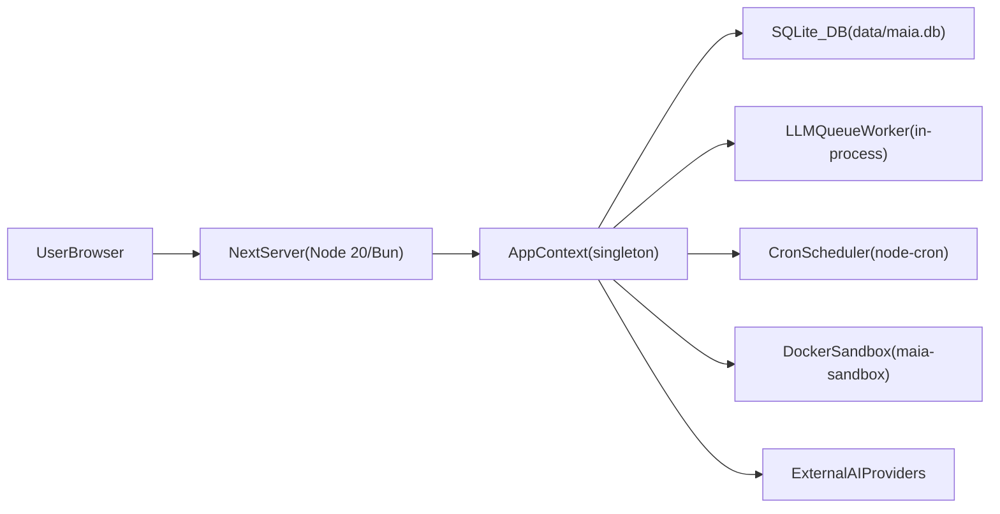

# Runtime and Operations

This document describes how the Maia application runs in development and production: the Node.js/Bun process, in-process background workers (LLM queue and cron), the Docker sandbox for terminal execution, and how deployment and CI/CD are organized.

## Runtime topology

The application is a single **Next.js server process** (Node 20+ or Bun). All backend behavior—API routes, database access, queue processing, and cron scheduling—runs inside that process. There are no separate worker processes or containers for the app itself.

- **NextServer**: Started via `bun dev` (development) or `bun run build` then `bun start` (production). Serves the App Router UI and all API routes under `src/app/api/**`.
- **AppContext**: Built once per process in `src/instrumentation-node.ts` when `registerNode()` runs (triggered by the first `ensureAppContext()` call from an API route). Holds `db`, `fs`, `http`, `events`, `processRunner`, and optional `sandboxContainerName`.
- **SQLite**: Single file at `data/maia.db` (path from `getDataDir()` in `src/lib/data-dir.ts`). WAL mode; no separate DB server.
- **LLMQueueWorker**: In-process priority queue in `src/lib/queue/llm-queue.ts`. One logical worker; jobs are processed by a timer and by `tickQueueProcessor()` on each `ensureAppContext()`. Chat/agent runs that touch the same session also go through **`runExclusive(sessionId)`** in `src/lib/history/session-lock.ts` so history appends and nested tool calls (e.g. `persona_run`) serialize per session while different sessions can progress concurrently.
- **CronScheduler**: In-process scheduler in `src/lib/cron/service.ts` using `node-cron`. Loads jobs from `cron_jobs` and runs them at the specified cron times.
- **DockerSandbox**: Optional. The `maia-sandbox` container from `docker-compose.yml` is used by the terminal tool when `SANDBOX_CONTAINER_NAME` is set; the Next.js process runs `docker exec` to run shell commands inside the sandbox.
- **ExternalAIProviders**: Ollama, OpenRouter, and (for web tools) Brave APIs. All accessed via the HTTP client in `AppContext`.

## Layered memory and semantic search (SQLite)

Maia keeps **all** semantic search and long-term memory structures in the **same SQLite database** as the rest of the app (`data/maia.db`). There is **no** separate vector database service.

- **Embeddings**: Settings define the embedding model (e.g. Ollama or OpenRouter). `src/lib/knowledge/embedding.ts` builds an adapter; `src/lib/knowledge/vector-store.ts` stores vectors in `knowledge_vectors` and `history_vectors`.
- **Per-turn smart context**: `buildRawRetrievedContext` and the knowledge/history search tools query those tables after embedding the user query.
- **Layered memory** (see [Backend and domain](backend-and-domain.md#knowledge-and-layered-memory), [Data model](data-model.md#semantic-memory-and-layered-memory)):
  - **Pre-prompt recall**: `src/lib/memory/preprompt.ts` embeds the current user message and pulls registry rows, related episodes, PARA facts (on disk under `data/agents/<id>/life/`), and a daily note excerpt; the runner prepends this inside the smart-context block so it is ordered before raw retrieval output.
  - **Registry / graph / compaction**: SQLite tables `memory_registry`, `memory_episodes`, `memory_entities`, `memory_edges`, `session_compactions`; tools live in `src/lib/tools/layered-memory-tools.ts`.
  - **Thinking**: `role = "thinking"` history rows are **not** indexed to `history_vectors`, so they do not appear in semantic search.
- **Bootstrap index**: Agents seed **`PERSONA.md`** from `defaults/agent` / `defaults/maia`; layered-memory pointers stay in skills plus markdown under `memory/` / `user/` instead of stuffing everything into persona prose.

## Background processes (in-process)

### LLM queue

- **Module**: `src/lib/queue/llm-queue.ts`, `src/lib/queue/llm-queue-handlers.ts`.
- **Startup**: In `src/instrumentation-node.ts`, after building `AppContext`:
  - `registerLlmQueueHandlers()` registers handlers for tools such as `runAgent`, `indexHistoryEntry`, `refreshEmbeddings`, `extractSearchQueries`, etc.
  - `startQueueProcessor(1000)` starts a `setInterval` that processes the queue every 1 second.
  - `tickQueueProcessor()` is called once immediately so jobs can run even before the first interval.
- **Tick on request**: Each time an API route calls `ensureAppContext()`, the instrumentation layer calls `tickQueueProcessor()` so the queue advances even if the interval timer has not fired in that worker.
- **Concurrency**: One job at a time (single worker) to avoid rate limits and keep ordering predictable.
- **Snapshot API**: `GET /api/queue` returns a JSON snapshot of queued jobs (see `docs/api/endpoints.md`). Implemented in `src/app/api/queue/route.ts`; it calls `ensureAppContext()` then `getQueueSnapshot()`.

### Cron scheduler

- **Module**: `src/lib/cron/service.ts`.
- **Startup**: In `src/instrumentation-node.ts`, `startCronScheduler(ctx, runAgentFn)` is called after the queue is started. It:
  - Loads all rows from `cron_jobs`.
  - Registers each job with `node-cron` using the job’s `expression`.
  - For built-in heartbeat: when the `builtin-heartbeat` job fires, it calls `fireHeartbeat(ctx, runAgentFn)` from `src/lib/heartbeat.ts`.
  - For user schedules and Maia-created rows: when a job fires, the scheduler gets or creates an **agents** session for **`maia`** and enqueues **`runAgent`** with either a **delegated persona** (`persona_id` + `persona_model`) or a **Maia prompt wake** (`cron_message`, defaulting to the built-in task-board sweep when empty). There is no tool-first `[CRON]` + `initialToolCall` path for `cron_jobs`.
- **Heartbeat**: The heartbeat is an internal tool (not exposed to agents) that wakes **only Maia**. She is prompted to check the task board and cron list, assign tasks, and ensure each active agent has a staggered cron job. See `docs/architecture/agent-system.md`.
- **Manual trigger**: `POST /api/cron/heartbeat` triggers `fireHeartbeat` directly. Used by external cron (e.g. system cron) or for testing; the in-process scheduler also fires the built-in heartbeat job on its schedule.
- **UI**: `POST /api/cron/jobs` creates user schedules (wake-up vs custom, Maia vs delegated persona, optional board task); `PATCH /api/cron/jobs/:id` updates user rows (always `agent_id` = `maia`, built-in rows return `400`); `DELETE /api/cron/jobs/:id` removes non-built-in jobs. See [API Endpoints](../api/endpoints.md).

## Sandbox container

Terminal execution runs inside a dedicated Docker container for isolation.

- **Definition**: `docker-compose.yml` at the project root.
- **Service**: `maia-sandbox`.
  - Image: `ubuntu:22.04`.
  - Command: `sleep infinity`.
  - `network_mode: none` — no network access from inside the container.
  - Volume: `maia-workspace` mounted at `/workspace` (read-write).
  - Capabilities: all dropped except `CHOWN` and `SETUID`; `no-new-privileges: true`.
- **Usage**: When `SANDBOX_CONTAINER_NAME` is set (e.g. to `maia-sandbox`), the terminal tool uses `AppContext.processRunner` to run `docker exec --workdir <cwd> <container> bash -c '<command>'`. The working directory and command are validated against the workspace root to prevent path traversal. See `docs/architecture/security.md` and `docs/architecture/tools.md`.
- **Start**: Run `docker compose up -d` (or `docker-compose up -d`) in the project directory to start the sandbox. The Next.js app does not start it automatically.

## Logging

Application logging uses a small **logging facade** in `src/lib/logger.ts` with levels `debug`, `info`, `warn`, `error` and optional structured fields (e.g. `agentId`, `sessionId`). Use it from the agent runner, queue, cron, and critical tools instead of raw `console` or ad hoc helpers so that log format and level are consistent. Optionally, a **request correlation id** (from a header or generated per request) can be passed through so logs for a single request can be grepped; this can be added to the facade or to `AppContext` when needed.

## Environment and configuration

- **Data directory**: Where `maia.db`, agents, knowledge, and tools live. Configurable via the UI (Settings) and/or code in `src/lib/data-dir.ts`; default is project `data/` (or similar as defined in the app).
- **Required / common env** (see `.env.example`):
  - `CREDENTIAL_MASTER_KEY`: 64-char hex for credential encryption.
  - `SANDBOX_CONTAINER_NAME`: Optional; set to `maia-sandbox` (or your container name) to use the Docker sandbox for terminal.
  - API keys (Brave, OpenRouter, etc.) can be set in `.env` or stored in the app Settings (credential vault).
- **Runtime guard**: Node-only initialization (DB, queue, cron) runs only when `process.env.NEXT_RUNTIME === "nodejs"` so these modules are not bundled for Edge.

## CI/CD

- **Workflows**: The repository may use `.github/workflows` for CI (build, lint, test, E2E). If present, inspect the workflow files for the exact steps.
- **Local quality gates** (from `package.json` and project conventions):
  - **Typecheck**: `bun run typecheck` or `bunx tsc --noEmit`.
  - **Lint**: `bun run lint`.
  - **Tests**: `bun test` (unit and integration tests under `src/__tests__/**`).
  - **E2E**: E2E tests (e.g. Playwright) under `e2e/`; run via the script defined in `package.json` (e.g. `bun run test:e2e`).
- **Build**: `bun run build` produces the Next.js production build; `bun start` runs the production server. The application does not ship a Dockerfile in the repo; deployment is typically via a platform (e.g. Vercel, Node host) or a separately maintained container image.

## Summary

| Concern           | Where it runs               | Key modules / config                                    |
| ----------------- | --------------------------- | ------------------------------------------------------- |
| HTTP / API        | Next.js server              | `src/app/api/**`                                        |
| DB                | Same process, SQLite file   | `src/lib/db.ts`, `AppContext`                           |
| LLM queue         | Same process, timer + tick  | `src/lib/queue/llm-queue.ts`, `instrumentation-node.ts` |
| Cron              | Same process, node-cron     | `src/lib/cron/service.ts`, `heartbeat.ts`               |
| Terminal commands | Docker container (optional) | `docker-compose.yml`, `processRunner`                   |
| External APIs     | Same process, HTTP client   | `AppContext.http`, `src/lib/ai/**`, tools               |

For request-level and data flow details, see [Backend and Domain](backend-and-domain.md), [Request Flows](request-flows.md), and [System Overview](system-overview.md).

## Performance considerations

- **Agent turn hot path:** Before building smart context, the runner runs `buildEmbeddings(ctx)` so knowledge files and unindexed history are embedded and retrieval sees current data. The runner then loads only the last N history entries for the recent-thread block via `getSessionRecent(ctx, sessionId)` (see `src/lib/history.ts`) instead of loading the full session, so long threads do not pull entire history into memory. Smart context and skills are fetched in parallel (`Promise.all([buildSmartContextBlock(...), getMatchedSkillsContent(...)])`) to reduce time-to-first-token.
- **Queue:** A single worker processes one job at a time (by design for rate limits and ordering). Queue depth is the natural backpressure; long-running jobs (e.g. `runAgent`) block others. Embedding jobs have higher priority so indexing can keep up.
- **I/O cost:** The main I/O costs are embedding and vector search (smart context, history indexing) and LLM calls. Embedding failures degrade to empty context and are logged; they do not fail the request.
