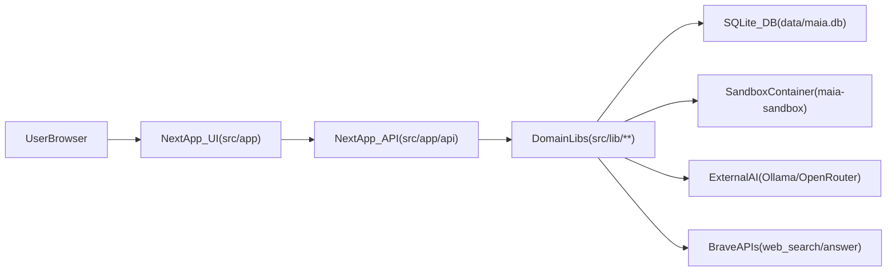
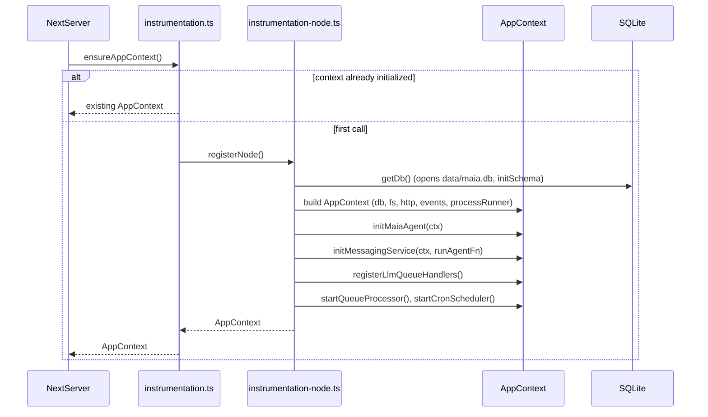

## Maia System Overview

This document gives a **top-down map of the Maia system**: how the browser UI, Next.js app, API routes, domain libraries, database, sandbox, and external services fit together. It is the starting point for understanding how everything is built under the hood.

- **UI layer**: Next.js 16 App Router React app under `src/app`, with shared components in `src/app/components`.
- **API layer**: Next.js App Router route handlers under `src/app/api/**`.
- **Domain & infrastructure layer**: Shared libraries under `src/lib/**` plus instrumentation in `src/instrumentation.ts` and `src/instrumentation-node.ts`.
- **Data layer**: SQLite database file at `data/maia.db`, schema and migrations in `src/lib/db.ts`.
- **Background orchestration**: In‑process LLM job queue and cron scheduler wired up in `src/instrumentation-node.ts`.
- **Sandbox & external services**: Docker sandbox for terminal commands, plus Brave, Ollama, and OpenRouter integrations.

### Architecture map

| Topic                                                   | Document                                             | When to read                                 |
| ------------------------------------------------------- | ---------------------------------------------------- | -------------------------------------------- |
| Request flows (chat, tasks, credentials, events)        | [request-flows.md](request-flows.md)                 | End-to-end flows from browser to DB and back |
| Backend and domain (AppContext, routes, domain modules) | [backend-and-domain.md](backend-and-domain.md)       | How API routes call into `src/lib/**`        |
| Data model and schema evolution                         | [data-model.md](data-model.md)                       | Tables, relationships, migrations            |
| Runtime (process, queue, cron, sandbox, CI/CD)          | [runtime-and-ops.md](runtime-and-ops.md)             | Where things run and how to operate          |
| Security (preamble, injection filter, credential vault) | [security.md](security.md)                           | Threat model and mitigations                 |
| Agent system (identity, context, heartbeat, cron)       | [agent-system.md](agent-system.md)                   | How agents and Maia are wired                |
| Context window (compression, smart context)             | [context-window.md](context-window.md)               | Token budget and history handling            |
| Tools (registry, tools, ToolContext)                    | [tools.md](tools.md)                                 | Tool interface and built-in tools            |
| Frontend (pages, components, state, SSE)                | [frontend-architecture.md](frontend-architecture.md) | UI structure and data flow                   |
| Testing (minimal-mocking policy, helpers, patterns)     | [testing.md](testing.md)                             | How to write and run tests                   |

### High-level component topology

The diagram below shows the main runtime components and how data flows between them.

#### Mapping diagram nodes to code

- **`UserBrowser`**
  - Any modern browser hitting the app at `http://localhost:3000` in development.
  - Uses the React SPA rendered by the Next.js App Router under `src/app`.

- **`NextApp_UI(src/app)`**
  - **Root layout**: `src/app/layout.tsx` sets up HTML skeleton, fonts, and imports `globals.css`.
  - **Primary pages**:
    - Home/chat: `src/app/page.tsx`
    - Agents: `src/app/agents/page.tsx`
    - Tasks: `src/app/tasks/page.tsx`
    - Cron: `src/app/cron/page.tsx`
    - Settings: `src/app/settings/page.tsx`
  - **Shared UI components**: `src/app/components/**` (chat message list, input bar, thread list, header, monitors).

- **`NextApp_API(src/app/api)`**
  - Next.js App Router route handlers under `src/app/api/**`.
  - Representative endpoints (see `docs/api/endpoints.md` for payloads):
    - Chat streaming: `src/app/api/chat/route.ts`
    - Sessions: `src/app/api/sessions/route.ts`, `src/app/api/sessions/[id]/route.ts`, `src/app/api/sessions/active/route.ts`
    - Agents: `src/app/api/agents/route.ts`, `src/app/api/agents/[id]/route.ts`
    - Tasks: `src/app/api/tasks/route.ts`, `src/app/api/tasks/[id]/route.ts`
    - Cron: `src/app/api/cron/jobs/route.ts`, `src/app/api/cron/heartbeat/route.ts`
    - Queue snapshot: `src/app/api/queue/route.ts`
    - Events SSE: `src/app/api/events/route.ts`
  - API routes call `ensureAppContext()` from `src/instrumentation.ts` to obtain the process‑wide `AppContext` before touching the DB, queue, cron, or tools.

- **`DomainLibs(src/lib/**)`\*\*
  - **Context & infrastructure**:
    - `src/lib/context.ts` – defines `AppContext`, `DbAdapter`, filesystem, HTTP client, and process runner interfaces.
    - `src/lib/db.ts` – opens `data/maia.db`, configures pragmas, and defines the schema via `initSchema`.
  - **Agents & history**:
    - `src/lib/agent/**` – system prompt assembly, agent execution loop, compression, and context query.
    - `src/lib/history.ts` – read/write history entries, compressed vs original arrays.
  - **Knowledge & embeddings**:
    - `src/lib/knowledge/**` – knowledge base indexing, semantic search, history vectors.
  - **Tools**:
    - `src/lib/tools/**` – file, terminal, web, browser, history, cron, credential tools, etc.
  - **Queue & cron**:
    - `src/lib/queue/llm-queue.ts` and `src/lib/queue/llm-queue-handlers.ts` – LLM job queue and tool handlers.
    - `src/lib/cron/service.ts` – cron scheduler that runs heartbeat and per‑agent jobs.
  - **Security**:
    - `src/lib/security/**` – injection filtering and security event logging.

- **`SQLite_DB(data/maia.db)`**
  - Database path: `getDataDir()/maia.db`. Default data directory is `data/` under the project root (overridable via `MAIA_DATA_DIR`); see `src/lib/data-dir.ts`. Created eagerly by `src/lib/db.ts`.
  - Primary schema defined in `initSchema` in `src/lib/db.ts`:
    - `sessions`, `history_entries`, `agents`, `credentials`, `settings`,
      `cron_jobs`, `security_events`, `active_session`, `knowledge_vectors`,
      `history_vectors`, `tasks`, `approved_tools`.
  - Inline migrations (via `PRAGMA table_info(...)`) keep existing databases up to date without a separate migration framework.

- **`SandboxContainer(maia-sandbox)`**
  - Defined in `docker-compose.yml` as the `maia-sandbox` service.
  - Used by terminal tools (via the process runner from `src/lib/context.ts`) to run shell commands in an isolated container with:
    - `network_mode: none`
    - Dropped Linux capabilities, `no-new-privileges`
    - Only the Maia data volume mounted under `/workspace`

- **`ExternalAI(Ollama/OpenRouter)`**
  - Concrete provider wiring lives under `src/lib/ai/**` (for example, `src/lib/ai/factory.ts`).
  - Used by `runAgent` in `src/lib/agent/runner.ts` to call models for chat, compression, and embeddings.

- **`BraveAPIs(web_search/answer)`**
  - HTTP client built in `src/lib/context.ts` and injected into the tool context.
  - Web tools under `src/lib/tools/**` call Brave’s web search and answers APIs using credentials from the credential vault.

### Instrumentation and AppContext lifecycle

The `AppContext` is a **singleton per Node.js process** that wires together DB, filesystem, HTTP client, event bus, LLM queue, cron scheduler, and sandbox configuration.

- **`src/instrumentation.ts`**
  - Exposes `getAppContext()` and `ensureAppContext()`.
  - Uses `register()` to lazily import and call `registerNode()` when `NEXT_RUNTIME === "nodejs"`.
  - After each `ensureAppContext()` call in Node runtime, ticks the LLM queue (`tickQueueProcessor`) once so jobs progress even if timers are not active in the current worker.

- **`src/instrumentation-node.ts`**
  - Builds an `AppContext` with:
    - `db: getDb()` from `src/lib/db.ts`
    - `fs`, `http`, and `processRunner` from `src/lib/context.ts`
    - `events` from `src/lib/events.ts`
    - `sandboxContainerName` from `SANDBOX_CONTAINER_NAME`
  - Initializes:
    - Maia’s agent definition via `initMaiaAgent(ctx)`
    - Messaging service and `runAgentFn`
    - LLM queue (handlers, periodic processor, initial tick)
    - Cron scheduler with `startCronScheduler(ctx, runAgentFn)`

### Layers and responsibilities

From the perspective of a new engineer:

- **UI layer (`src/app`, `src/app/components`)**
  - Renders pages and components, manages local React state.
  - Talks to the API layer via `fetch` and `EventSource`.

- **API layer (`src/app/api/**`)\*\*
  - Thin HTTP layer that:
    - Validates input (often using `zod`).
    - Calls `ensureAppContext()` to get `AppContext`.
    - Delegates to domain libraries in `src/lib/**`.
    - Shapes HTTP/SSE responses for the browser.

- **Domain & infrastructure layer (`src/lib/**`)\*\*
  - Owns all long‑lived behavior:
    - Agent execution, compression, and context assembly.
    - History, knowledge base, vector search.
    - Tools, credential vault, security, queue, cron.
  - Completely testable in isolation via the `DbAdapter` and context interfaces.

- **Data layer (`src/lib/db.ts`, `data/maia.db`)**
  - Durable storage for sessions, history, agents, settings, tasks, cron jobs, embeddings, and security events.
  - Migrated in place at startup via `initSchema`.

- **Background orchestration (queue + cron)**
  - Lives entirely in `src/lib/queue/**` and `src/lib/cron/**`, wired by `src/instrumentation-node.ts`.
  - Handles heartbeats, scheduled agent runs, and queued long‑running LLM tasks without requiring separate worker processes.

### Where tests live

Architecture behavior is covered by tests that mirror the source structure:

- **API routes**: `src/__tests__/app/api/**` exercise route handlers under `src/app/api/**` using the `_setTestContext` helper from `src/instrumentation.ts`.
- **Pages and components**: `src/__tests__/app/**` cover `src/app/page.tsx`, settings/agents/tasks/cron pages, and shared components.
- **Domain libraries**: `src/__tests__/lib/**` cover `src/lib/agent/**`, `src/lib/history.ts`, `src/lib/knowledge/**`, `src/lib/tools/**`, `src/lib/queue/**`, `src/lib/cron/**`, and `src/lib/security/**`.

When changing behavior described in this document, update or add tests in the corresponding `src/__tests__` location first so the documentation stays true to the enforced behavior.
