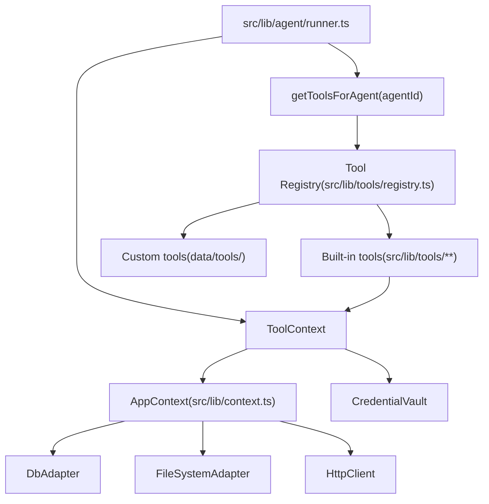

# Tool Architecture

## Tools, registry, and context wiring

The diagram below shows how tools are registered, how they receive a `ToolContext` built from `AppContext`, and where the main tool and domain code lives.



- **Registry**: `src/lib/tools/registry.ts` holds the list of built-in tools (with `maiaOnly` where applicable) and merges in approved custom tools from `data/tools/<slug>/manifest.json`. `getToolsForAgent(agentId)` returns the set of tools available to that agent.
- **ToolContext**: Extends `AppContext` with `agentId`, `sessionId`, `volumeRoot`, `defaultCwd`, `providerFactory`, and `getToolsForAgent`. Built in `src/lib/agent/runner.ts` and passed to every tool’s `execute(args, context)`.
- **AppContext**: Provides `db`, `fs`, `http`, `events`, `processRunner`, and optional sandbox/browser options. See [Backend and Domain](backend-and-domain.md).

## Tool Interface

All tools implement a common interface that enables dependency injection and testability:

```typescript
interface Tool<TArgs extends ZodTypeAny, TResult> {
  name: string;
  description: string; // shown to the LLM in the tool list
  schema: TArgs; // Zod schema for argument validation
  execute(args: z.infer<TArgs>, context: ToolContext): Promise<TResult>;
}
```

**Tool results are never null.** Every tool must return a valid success payload (e.g. object or string) or throw. The runner normalizes `undefined`/`null` return values to `{ success: true }` so SSE and history always receive a non-null result; tools should still return explicit success/error shapes (e.g. `cron_delete` returns `{ success: true, message: "Cron job deleted." }`).

```typescript
interface ToolContext {
  agentId: string;
  sessionId: string;
  db: DatabaseClient; // injectable — use in-memory DB in tests
  fs: FileSystemClient; // injectable — use mock FS in tests
  credentialVault: CredentialVault;
  injectionFilter: InjectionFilter;
  dockerClient: DockerClient; // injectable — use mock in tests
  httpClient: HttpClient; // injectable — use mock in tests
  volumeRoot: string; // path to agent's sandbox root
}
```

## Tool Registry

Tools are registered in a central registry. Maia-only tools are marked with `maiaOnly: true`.

```typescript
const TOOL_REGISTRY: ToolRegistration[] = [
  { tool: fileCrudTool, maiaOnly: false },
  { tool: terminalTool, maiaOnly: false },
  { tool: webSearchTool, maiaOnly: false },
  { tool: messagingTool, maiaOnly: false },
  { tool: historyTool, maiaOnly: false },
  { tool: credentialsTool, maiaOnly: false },
  { tool: agentManagementTool, maiaOnly: true },
  { tool: cronTool, maiaOnly: true },
];

function getToolsForAgent(agentId: string): Tool[] {
  const staticTools = TOOL_REGISTRY.filter(
    (reg) => !reg.maiaOnly || agentId === "maia",
  ).map((reg) => reg.tool);
  const customTools = getApprovedCustomTools(); // from data/tools approved manifests
  return [...staticTools, ...customTools];
}
```

Approved custom tools (see **Custom agent tools** below) are loaded from `data/tools/<slug>/manifest.json` and merged in for all agents. Built-in tool names take precedence; a custom tool whose function name clashes with a built-in is skipped.

### Minimal tool set (find_tool and find_skill)

Only two tools are sent to the LLM by default: **find_tool** and **find_skill**. The runner uses `getMinimalToolDefsForAgent(agentId)` so the model discovers other tools via **find_tool** (natural-language search over the full tool set) and operational guidance via **find_skill** (natural-language search over skills). Tool execution still resolves by name from `getToolsForAgent(agentId)`, so once the model has discovered a tool (e.g. from a find_tool result), it can invoke it by name.

## Tool Definitions (LLM-facing)

Each tool's schema is converted to a JSON Schema for the AI provider:

```typescript
// Example: file_read
{
  name: "file_read",
  description: "Read the contents of a file within the workspace volume.",
  parameters: {
    type: "object",
    properties: {
      path: {
        type: "string",
        description: "Path relative to the workspace root (e.g., 'workspace/project/main.py')"
      }
    },
    required: ["path"]
  }
}
```

## Individual Tool Specifications

### `file_crud` — File Operations

| Function      | Args                            | Returns    | Notes                     |
| ------------- | ------------------------------- | ---------- | ------------------------- |
| `file_read`   | `path: string`                  | `string`   | File contents             |
| `file_write`  | `path: string, content: string` | `void`     | Creates or overwrites     |
| `file_append` | `path: string, content: string` | `void`     | Appends to file           |
| `file_delete` | `path: string`                  | `void`     | Deletes file or empty dir |
| `file_list`   | `directory: string`             | `string[]` | List files in directory   |
| `file_move`   | `from: string, to: string`      | `void`     | Move/rename               |
| `file_exists` | `path: string`                  | `boolean`  | Check existence           |

Paths are resolved against the volume root. In addition:

- Paths starting with `knowledge/` (e.g. `knowledge/reports/summary.md`) resolve to the shared knowledge base at `data/knowledge/`, so agents can read and write reports there with the same file tools.
- Paths starting with `tools/` (e.g. `tools/my-tool/manifest.json`) resolve to the custom tools directory at `data/tools/`. Agents can create and edit tool folders there. **Registered (approved) tools are read-only:** write operations (file_write, file_append, file_delete, file_move, directory_create) to a path under `data/tools/<slug>/` fail when that slug is in the approved list. Maia must use **tool_deregister** first to allow edits; after edits, the agent creates a new review task for Maia.

Operations outside the volume, knowledge base, or tools directory throw.

### `terminal` — Shell Execution

| Function        | Args                            | Returns                        |
| --------------- | ------------------------------- | ------------------------------ |
| `terminal_exec` | `command: string, cwd?: string` | `{ stdout, stderr, exitCode }` |

- Executes inside the Docker sandbox container.
- Default timeout: 30 seconds (configurable in settings).
- `cwd` defaults to `/workspace` if not provided.
- stdout and stderr are capped at 50KB each to prevent context flooding.
- The Maia bash-like parser supports **heredoc** syntax (`<<'EOF'` … `EOF`) so commands such as `cat > file <<'EOF'\n...\nEOF` are parsed correctly; the heredoc body is not treated as a file path or redirect target.
- Built-in commands (`ls`, `touch`, `cat`, `cd`) treat leading arguments that look like Unix options (e.g. `-l`, `-a`, `-n`) as ignored; the first non-option argument is used as the path/operand. So `ls -la`, `touch -a file`, `cat -n file`, and `cd -L ~/dir` behave as intended.

### `web_search` — Brave Web Search

| Function     | Args                                 | Returns          |
| ------------ | ------------------------------------ | ---------------- |
| `web_search` | `query: string, maxResults?: number` | `SearchResult[]` |

```typescript
interface SearchResult {
  title: string;
  url: string;
  snippet: string; // injection-filtered
  fetchedAt: string;
}
```

- **Brave only**: Uses Brave Search API. Requires `BRAVE_SEARCH_API_KEY` (no fallback).
- Results pass through `InjectionFilter`. If redaction occurred, the result includes a warning field.
- Prefer `web_answer` for web-grounded Q&A; use `web_search` when you specifically need raw links or plan to fetch a specific page (for example with `fetch_web_page`).

### `web_answer` — Brave Answers (AI-Grounded Answers)

| Function     | Args                                         | Returns                                 |
| ------------ | -------------------------------------------- | --------------------------------------- |
| `web_answer` | `question: string, enableResearch?: boolean` | `{ answer: string, fetchedAt: string }` |

- AI-generated answers backed by real-time web search (Brave Answers API, OpenAI-compatible chat/completions).
- Same API key as `web_search`. Use for questions that need current, cited information.
- `enableResearch` is accepted for backward compatibility but has no effect; for multi-search research mode, use `web_research` instead.

### `web_research` — Brave Answers Research (Streaming, Multi-search)

| Function       | Args                                                                               | Returns                                 |
| -------------- | ---------------------------------------------------------------------------------- | --------------------------------------- |
| `web_research` | `question: string, enableCitations?: boolean, language?: string, country?: string` | `{ answer: string, fetchedAt: string }` |

- Runs Brave Answers in streaming research mode (`stream: true`, `enable_research: true`) and aggregates the answer text.
- Use for complex, research-grade questions where thoroughness matters more than latency.
- **Call once** with a single comprehensive question covering all aspects; do not split into multiple smaller queries—the API performs multi-search internally.
- `enableCitations` is accepted for forward compatibility but currently ignored because Brave Answers research mode does not support `enable_citations`.
- `language` and `country` map directly to Brave Answers advanced parameters for localisation.
- `enableEntities` is also accepted for forward compatibility but currently ignored because Brave Answers research mode does not support `enable_entities`.

### Ollama / Embeddings Timeouts and Heartbeat/Cron

- Ollama chat (`/api/chat`) and embedding (`/api/embed`, `/api/show`) calls use a dedicated Undici HTTP client with **very long headers/body timeouts** so slow models can complete without `UND_ERR_HEADERS_TIMEOUT`.
- When the embedding service fails (network error or 5xx), semantic search APIs (`searchKnowledge`, `searchHistory`, `buildRawRetrievedContext`) **degrade to empty context** instead of throwing, and log concise warnings.
- Heartbeat and cron-fired jobs are hardened so that:
  - Embedding refresh failures are logged but do not crash the heartbeat.
  - Agent runs that fail (for example, Ollama `/api/chat` offline) are caught and logged inside the heartbeat and cron scheduler.
  - System-generated `[CRON]` agent runs disable smart context (`enableSmartContext: false`) because the cron payload already includes all necessary instructions.

### `fetch_web_page` — Page Content via Real Browser

| Function         | Args                                     | Returns          |
| ---------------- | ---------------------------------------- | ---------------- |
| `fetch_web_page` | `url: string, maxContentLength?: number` | `WebPageContent` |

```typescript
interface WebPageContent {
  url: string;
  title: string;
  content: string; // main text, injection-filtered
  fetchedAt: string;
  injectionWarning?: string;
}
```

- Opens the URL in a **one-off** Playwright browser (no shared session). Uses Chromium or Brave if `BRAVE_EXECUTABLE_PATH` is set.
- Waits for DOM/content, extracts title and main body text, runs content through `filterText` with source `fetch_web_page:<url>`.
- Optional `maxContentLength` truncates content to avoid context overflow.
- Improves resilience to bot protections (real browser, JS execution). Timeout ~30s; navigation errors surface as thrown errors.

### Browser automation suite — Session-scoped Brave

One browser **page per session** (keyed by `sessionId`). Use for multi-step agent-mode tasks (navigate, snapshot, click, type, fill forms). **`web_search`** returns links; **`web_answer`** returns AI-generated answers grounded in web search.

| Function                | Args                                                   | Returns                |
| ----------------------- | ------------------------------------------------------ | ---------------------- |
| `browser_navigate`      | `url: string`                                          | `{ ok, url }`          |
| `browser_snapshot`      | `interactiveOnly?: boolean, maxDepth?: number`         | `{ snapshot: string }` |
| `browser_click`         | `ref?: string, selector?: string, button?, modifiers?` | `{ ok }`               |
| `browser_type`          | `ref?, selector?, text: string, clear?, submit?`       | `{ ok }`               |
| `browser_fill`          | `ref?, selector?, value: string`                       | `{ ok }`               |
| `browser_select_option` | `ref?, selector?, values: string[]`                    | `{ ok }`               |
| `browser_go_back`       | _(none)_                                               | `{ ok }`               |
| `browser_close`         | _(none)_                                               | `{ ok }`               |

- **Refs**: `browser_snapshot` injects `data-maia-ref` on interactive elements and returns a text list (e.g. `[1] button "Submit"`). Use `ref: "1"` in click/type/fill/select. Alternatively pass a CSS `selector` (e.g. `#id`, `.class`).
- **Browser**: Brave via Playwright when `BRAVE_EXECUTABLE_PATH` (or OS default) is set; otherwise Chromium. Optional env `BROWSER_TOOLS_ENABLED=1` can gate the suite (documented in README/env).

### `credentials` — Credential Vault (LLM-facing)

| Function            | Args                         | Returns                | LLM Access             |
| ------------------- | ---------------------------- | ---------------------- | ---------------------- |
| `credential_create` | `key: string, value: string` | `void`                 | Yes                    |
| `credential_update` | `key: string, value: string` | `void`                 | Yes                    |
| `credential_delete` | `key: string`                | `void`                 | Yes                    |
| `credential_list`   | _(none)_                     | `string[]` (keys only) | Yes                    |
| `credential_get`    | `key: string`                | `string` (value)       | **NO** — internal only |

### `messaging` — Inter-agent and User Communication

| Function       | Args                                    | Returns  |
| -------------- | --------------------------------------- | -------- |
| `message_send` | `to: "user" \| agentId`, `text: string` | `string` |

`message_send` (to agent) behavior:

1. Find existing session where participants are exactly `[callerAgentId, toAgentId]`.
2. If not found, create a new session in the database (type `"agents"`) via `createSession`.
3. Append message.
4. Run target agent; when they reply, their response is looped back to the caller in the agent-agent session.
5. **Automatic reply forwarding:** Each agent's reply is automatically fed to the other. No further message_send calls are needed—the conversation continues until one indicates they are done.
6. **[DONE] convention:** If either agent ends their reply with `[DONE]`, they indicate they do not want to continue. The reply (with `[DONE]` stripped) is posted to the caller session, and the loop ends.

`message_send` (to `"user"`) behavior:

1. Add caller agent to active user session participants (if not already).
2. Append message as `role: "agent"` entry.
3. Emit SSE event to UI.
4. Returns `"Message sent to user."`

### `ask_user` — Ask the user questions (choices + Other)

| Function   | Args                                                                   | Returns                  |
| ---------- | ---------------------------------------------------------------------- | ------------------------ |
| `ask_user` | `questions: Array<{ id, prompt, choices?, allowOther? }>` (1–20 items) | `{ questions, answers }` |

- **Purpose:** Lets agents ask the user one or more questions with optional predefined choices and an “Other” option for custom input. The tool blocks until the user submits all answers.
- **Flow (end-to-end):**
  1. Agent calls `ask_user` with an array of questions. Each question has `id`, `prompt`, optional `choices` (string array), and optional `allowOther` (default true when choices exist).
  2. The server registers a pending question in the in-process question service, emits a `question` SSE event via the shared event bus (`sessionId`, `requestId`, `questions`), and the tool’s `execute` awaits a promise.
  3. The client home page receives the `question` event and appends a **user-input bubble** to the chat stream:
     - The bubble renders the questions inline (radios for choices, optional “Other” text input, or free text when no choices).
     - The rest of the thread remains visible; there is no fullscreen modal.
  4. When the user submits in the inline bubble, the client POSTs to `/api/chat/question-response` with `sessionId`, `requestId`, and `answers` (record of question id → string). On success, the bubble is updated in-place to an **answered, read-only** state that shows each question with its final answer.
  5. The question service resolves the pending promise; the tool returns `{ questions, answers }` to the agent and the loop continues.
  6. The `ask_user` tool call result (`{ questions, answers }`) is persisted as a `tool_call` history entry. When loading history, the UI maps these entries back into answered user-input bubbles so past Q&A is always visible (but never editable).
- **Result:** The agent receives the original questions and the user’s answers (keyed by question `id`). “Other” answers are returned as `"Other: <user text>"`. The user sees both the pending form and the final Q&A inline in the chat history.
- **Timeout:** Pending questions time out after 10 minutes if the user never submits; the tool then rejects with an error, which surfaces in the chat as a system message.

### `history` — Session Management

Full API in [PLAN.md — History Tool API](../PLAN.md#history-tool-api).

### Knowledge base and semantic search

**Storage**: The knowledge base is markdown files under `data/knowledge/`. Agents use the **existing file tools** to read and write there: any path starting with `knowledge/` (e.g. `knowledge/reports/q4-summary.md`) is resolved to `data/knowledge/...`. Store human-readable reports and durable knowledge under `knowledge/` so they are discoverable via semantic search.

**Indexing**: The knowledge base is indexed on each heartbeat (one embedding per file, no chunking). Session history is indexed on append (original and compressed entries). Both use the same embedding model (e.g. `nomic-embed-text` via Ollama) and a shared vector store.

| Function                  | Args                               | Returns                                                  |
| ------------------------- | ---------------------------------- | -------------------------------------------------------- |
| `smart_context`           | `context: string, command: string` | `{ block: string, queries: string[] }`                   |
| `knowledge_search`        | `query: string, limit?: number`    | `{ path, content, score }[]`                             |
| `history_semantic_search` | `query: string, limit?: number`    | `{ sessionId, entryId, content, isCompressed, score }[]` |

- **`smart_context`**: **Prefer this over knowledge_search and history_semantic_search** when querying prior knowledge or session history. The agent provides `context` (what to base search queries on) and `command` (what they are trying to accomplish). The system generates search queries, retrieves from history and knowledge, filters relevant sources, and returns the full filtered content (sources in their entirety, no summarization). Smart context also includes **skills** (see below): only global skills and the current agent’s local skills are offered to the LLM.
- **`knowledge_search`**: Semantic search over the knowledge base. Returns the most relevant documents (full content). Use to find stored reports and durable knowledge.
- **`history_semantic_search`**: Semantic search over past session history. Returns the most relevant past messages or tool results. Use when you need to find something by meaning rather than keywords. Existing fuzzy search (`history_find`, `history_search_all`) remains available.

### Skills (global and per-agent)

Skills are markdown files with YAML frontmatter (`name`, `description`) and a body of instructions. They are matched to the user message (semantic or LLM-based) and injected into context when relevant.

- **Global skills**: `data/skills/` — available to all agents. Seeded from `defaults/skills/` on first run when no skills exist. Example: `defaults/skills/building-skills.md` describes how to create skills (global vs local).
- **Per-agent skills**: `data/agents/<agent_id>/skills/` — only that agent sees them. Maia’s skills are seeded from `defaults/maia/skills/` when her skills dir is empty (e.g. `agent-creation-and-lifecycle.md`, which documents persona/catalog workflows).

Smart context and skill matching **only** offer global skills plus the **current agent’s** local skills to the LLM; other agents’ skills are never included.

### Persona orchestration (Maia only)

| Tool                     | Purpose                                                                             |
| ------------------------ | ----------------------------------------------------------------------------------- |
| `persona_list`           | Enumerates merged catalog personas (defaults + `data/personas/catalog`).             |
| `persona_get`            | Loads instructions + metadata for a persona id.                                     |
| `persona_run`            | Executes a delegated persona turn inside the caller session with a whitelisted model. |
| `persona_catalog_upsert` | Writes/replaces `data/personas/catalog/<slug>.toml` using Codex-style fields.       |
| `persona_override_write` | Replaces layered markdown under `data/personas/overrides/<slug>.md`.                |

Legacy **`agent_*`** CRUD helpers were removed from `TOOL_REGISTRY`; orchestration relies on delegated personas plus Maia’s **`PERSONA.md`** (`copyDefaultAgentFiles` seeds only `PERSONA.md`, workspace skeletons, and optional starter markdown under `memory/` / `user/`).

### `cron` — Job Scheduling (Maia only)

| Function        | Args                                                                                              | Returns                                             |
| --------------- | ------------------------------------------------------------------------------------------------- | --------------------------------------------------- |
| `cron_echo`     | `message: string`                                                                                 | `string` (echoes message; used by legacy cron jobs) |
| `cron_schedule` | `id, expr`, optional **`tool`/`args`** (legacy tool-first wake), optional **`prompt_wake`** or **`cron_message`** (Maia prompt wake; default copy drives **task_list** / **task_update**), optional **`persona_id`** + **`persona_model`** (delegated persona wake on **maia**; message defaults same task-review text), **`desc`** | `string` (jobId)                                    |
| `cron_list`     | _(none)_                                                                                          | `CronJob[]` (includes persona/prompt fields when set) |
| `cron_delete`   | `jobId: string`                                                                                   | `{ success: true, message: string }`                |

**cron_delete** can remove any job by ID, including built-in or system jobs (e.g. the heartbeat job). The in-process scheduler unschedules the job immediately so it stops firing.

Scheduled jobs persist **`persona_id`**, **`persona_model`**, and **`cron_message`** on `cron_jobs`. At fire time: **persona wake** runs Maia with **`personaTurn`** and the stored message (default task-review prompt); **prompt wake** (`cron_message` non-null, no persona) runs **`runAgent`** with that message and no **initialToolCall**; **legacy** wakes send **`[CRON]`** plus the configured **initialToolCall**. Use **`cron_echo`** with **`{ message: "..." }`** only when you explicitly want the legacy pattern.

Cron expressions follow standard 5-field format: `* * * * *` (minute, hour, day, month, weekday).

The heartbeat is implemented as the built-in cron job `builtin-heartbeat` in `cron_jobs`. When it fires, it invokes an internal **heartbeat tool** (not visible to agents) that wakes **only Maia** so she can check the task board and cron job list, assign tasks, and ensure each active agent has a cron job. There are **no automatic staggered per-agent run jobs**; agent cron jobs are created only when Maia (or an authorized caller) uses **cron_schedule** at her chosen time and frequency (e.g. so agents do not overlap).

### Custom agent tools (data/tools)

Agents can define new tools under `data/tools/`. Each tool is a folder `data/tools/<slug>/` with at least a `manifest.json`. Paths under `tools/` (e.g. `tools/my-tool/manifest.json`) are available via the file tools so agents can create and edit tool definitions.

**Manifest schema** (`manifest.json`):

- `name`: string (tool name)
- `description`: string
- `functions`: array of `{ name, description, parameters }` where `parameters` is JSON Schema (same shape as `ToolDefinition.parameters`). One manifest can expose multiple functions.

**Proposal flow (task-based):**

1. An agent creates the tool folder and `manifest.json` under `data/tools/<slug>/` using file tools (only allowed if that slug is not yet registered).
2. The agent creates a **task** assigned to **Maia** with title e.g. `Review tool: <slug>` and description that can include the proposing agent (or Maia uses the task’s `created_by`).
3. Maia sees the task, reads `tools/<slug>/manifest.json` (and any code in that folder) via **file_read**, and performs a security review: no hardcoded API keys; credentials must use the credential vault; the tool must not bypass oversight or security.
4. **If Maia rejects:** She marks the review task done, creates a new task assigned to the proposing agent with a clear description of what to fix, and uses **message_send** to that agent with the same feedback.
5. **If Maia approves:** She calls **approve_tool(slug)** to register the tool, then marks the review task done.
6. The proposing agent (if rejected) fixes the tool, marks their task done, and creates a new "Review tool: <slug>" task for Maia.

**Read-only registered tools:** Once a tool is approved, the folder `data/tools/<slug>/` becomes read-only for file writes. To edit a registered tool, Maia must call **tool_deregister(slug)** first; then the agent can edit and create a new review task for Maia.

| Function          | Args               | Returns            | Who       |
| ----------------- | ------------------ | ------------------ | --------- |
| `approve_tool`    | `toolSlug: string` | `{ approved }`     | Maia only |
| `tool_deregister` | `toolSlug: string` | `{ deregistered }` | Maia only |

**Execution:** Custom tools are loaded into the registry and appear in `getToolsForAgent` for all agents. Execution is currently a **stub**: when an agent calls a custom tool function, the result is a message that the tool is registered but execution is not yet implemented. A future phase may add script-based execution (e.g. `data/tools/<slug>/run.js`) with security constraints and Maia review criteria (vault for credentials, no key leakage).

## Tool Execution in Agentic Loop

When an AI response contains tool calls:

1. Parse all tool calls from the response.
2. Validate each tool name against the registry for this agent.
3. Parse and validate arguments against the tool's Zod schema.
4. Execute tools (sequentially by default; parallel if AI explicitly requests it).
5. Collect results.
6. Append tool calls + results as entries to the session (original form).
7. Continue the AI loop with results in context.

### Environment (optional)

- **`BRAVE_SEARCH_API_KEY`** — **Required** for `web_search` and `web_answer`. No fallback. Get a key at [Brave Search API](https://api.search.brave.com/).
- **`BRAVE_EXECUTABLE_PATH`** — Path to Brave browser for Playwright. When set, `fetch_web_page` and the browser automation suite use Brave; otherwise Chromium. OS defaults: Windows `C:\Program Files\BraveSoftware\Brave-Browser\Application\brave.exe`, macOS `/Applications/Brave Browser.app/Contents/MacOS/Brave Browser`, Linux `/usr/bin/brave-browser` (or first existing of `brave`, `brave-browser-stable`).
- **`BROWSER_TOOLS_ENABLED`** — Browser automation suite is **off by default**. Set to `1` to register and enable `browser_navigate`, `browser_snapshot`, `browser_click`, etc., until Brave (or Chromium) is available.

### Tool Error Handling

Tool errors are returned to the AI as error results, not thrown:

```typescript
{
  tool_name: "file_read",
  error: "SecurityError: Path traversal attempt detected",
  success: false
}
```

This allows the AI to understand what went wrong and adjust its approach.
